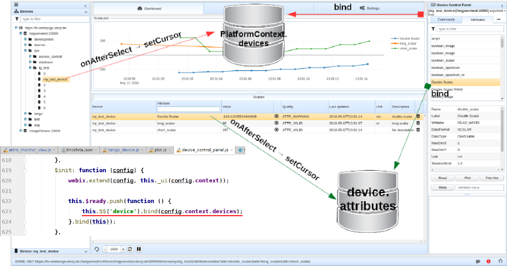
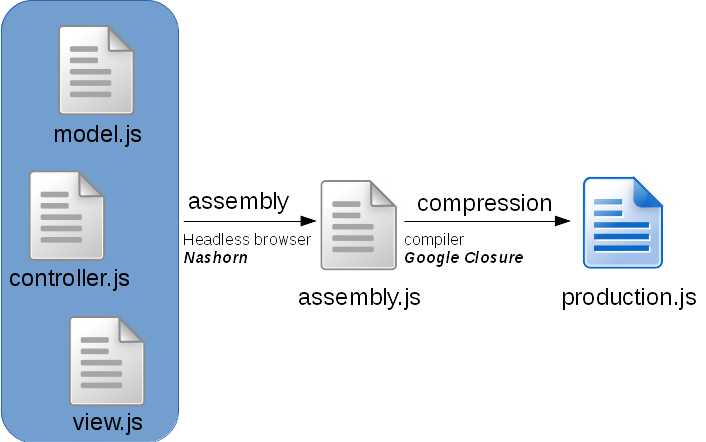

[TOC]

We shall start this developer guide with a super short introduction to the basic web technologies which are used in Waltz. 
If you don't need this, please, skip this part and go directly to the Waltz description.

# Short introduction to the basics of Web
Let's start with Client-Server architecture which looks like this at the first glance.

In our case we consider Browser as a Client and if we deep a bit, we get:

Browser via sends HTTP request to a specific URL. 
Server returns HTTP response that represents static/dynamic data on a local server system.

For example, Request URL “http:localhost:8080/jsTangORB/” means jsTangORB folder on the Server which returns as response index.html 

_Apache Tomcat_ (a Java HTTP web server environment) and _Servlet_ (a Java program that extends the capabilities of a server) 
are both middleware. Apache Tomcat binds itself to HTTP port and Servlet transforms API, 
so you don't need to keep in mind socets and ports.

_REST API_ is philosophy, a set of constraints.

It uses structured requests:
* http://{host}/{app}/{api}/{version}/{collection} e.g. http://localhost:8080/my-app/users
* http://{host}/{app}/{api}/{version}/{collection}/{item} e.g. http://localhost:8080/my-app/users/123
* http://{host}/{app}/{api}/{version}/{collection}/{item}/{sub-collection}

It adds semantic to HTTP methods:
* GET → get resource
* POST → create new resource
* PUT → update resource
* DELETE → remove resource

JAX-RS –  is a Java programming language API specification for server/client side REST implementation. 
Using previous diagrams JAX-RS will take the following place (note annotations on the code):

**Tango REST API is a RESTful view on Tango Controls.** It is just a SPECIFICATION!!!
http://{host}/{app}/{api}/{version}/{collection}/{item}/{sub-collection} → http://host/tango/rest/rc4/hosts/tango_host/10000/devices

So putting it all together, we get the following diagram:

# Waltz

From the developer point of view it is important to understand the following: Waltz per se is a web application built on top of WaltzPlatform. WaltzPlatform is a framework for Tango web applications (the framework may be extended to non-Tango applications as well, see architecture).

## Waltz application

Waltz application is a web application built using WaltzPlatform. Waltz is distributed as .war file.

## WaltzPlatform

WaltzPlatform is a framework on top of JavaScriptMVC-1.5.x and webix. WaltzPlatform provides building blocks (API, UI components) for developing custom web applications. WaltzPlatform uses Tango REST as one of the backends and therefore allows interaction with Tango Controls.

WaltzPlatform can be extended to non-Tango backends as well:

   

WaltzPlatform is distributed as git repository (forks or source code archive)

Waltz itself consists of 2 parts: platform and end user UI. If you need, you can extent platform part, e.g.  at the moment Waltz has Tango Controls data source, but it can be extended to EPICS.

Frankly speaking, as a frontend developer you don't need to know the server part. Here we would like to give you a short overview to let you know how it is organized:

## Waltz Tango REST backend (mTangoREST.server)
[mTangoREST.server](https://github.com/ingvord/mtangorest.server) - is a Java implementation of a Tango Controls REST API specification. If you need C++ version, please, visit [RestDS](http://tangodevel.jinr.ru/git/tango/web/RestDS) page.

mTangoREST.server has [two distributions](https://github.com/Ingvord/mtangorest.server/releases): .jar and .zip

The difference is shown in the following diagram:

A high level overview is presented in C&C diagrams.

**.jar**
* For development/small production deployment
* Standalone Tango device 
* Integration with standard Tango tools (Astor)
* Using launch script
* Dokerized

**.war**
* For production deployment:
    - Allows fine Tomcat tuning
    - High load (1K-10K users)
    - Standard enterprise infrastructure
* Embedded Tango device 
    - Configuration in WEB-INF/web.xml

Pipeline of the mTangoREST.server request can be presented like this:

Where 
* org.tango.web.server.filters; 

** org.tango.web.server.providers;

*** org.tango.web.server.resolvers, org.tango.web.server.interceptors.

Tango JAX-RS resources - Tango entities (aka device, attribute, commands etc) in mTangoREST.server.
The examples of code structure and Device class are below:

If you debug Device.java class, you will see that URL maps onto the method via annotation in the class:

Deployment should be done by system administrators. Below you can see how it was done in ESRF and DESY.

# WaltzPlatform

WaltzPlatform is a framework for building Tango web applications. Waltz application is such application.

WaltzPlatform from the developer point-of-view is a bunch of jmvc applications, backend and widgets. 

Project structure is defined by [javascriptmvc-1.5.x](https://github.com/jmvc-15x/javascriptmvc-1.5.x) (jmvc) framework.

Each jmvc application has the following:

* include.js
* JS inheritance emulation
* documentation auto generation
* test console where you can run Unit tests. You can test widget(s) separately.
* packaging
* OpenAjax for loose coupling

WaltzPlatform module diagram:

## High level architecture overview

Waltz implements classical 3-tiers architecture:

Where __data access layer__ is _Transport_. __Functional layer__ is PlatformAPI i.e. UI-less part of the WaltzPlatform. 
Finally __UI layer__ is _webix_widgets_ i.e. smart components included into WaltzPlatform that can be used as building blocks 
for custom applications/widgets built on top of WaltzPlatform.

## Platform API

Important part of the Platform is its API. Waltz Platform API has the following parts:

### UIBuilder

UIBuilder provides API to build UI of the application based on WaltzPlatform. Below is an example of using UIBuilder to build Waltz application UI:  

UIBuilder supports customization of all 5 panels, as well as not using some of the panels. Below is an example of an application that uses only main view panel:

Full UIBuilder API reference: [link]()

### Tango device model

WaltzPlatform provides high level API of the Tango devices model e.g. TangoDevice.

Full API reference of the Tango device model can be found here: [link]()

### Tango REST API js adapter

WaltzPlatform provides API to Tango REST. TangoRest API implements builder pattern:

### Utility models and helpers

#### PlatformContext

Context of the application. 

Full API reference: [link]()

#### UserContext

Developer may store custom data per user basis using UserContext API. UserContext has _ext_ field that can store any data. UserContext may be backed by a dedicated backend to persist the data (for instance, [UserContextBackend](https://github.com/tango-controls-waltz/tango-webapp-user-context)). By default all the data is stored in-memory DB provided by WaltzPlatform.

To specify UserContext backend provide env argument to assemble command:

Full UserContext API reference: [link]()

#### include.js

include.js is a part of jmvc. include.js is used to define dependencies of the application:

#### JS inheritance

WaltzPlatform provides a number of models that can be extended using jmvc inheritance feature:

#### webix widgets

WaltzPlatform uses [webix](http://webix.com) for UI components and data binding.

Data binding allows dynamic update of the components bound to each other:  

All WaltzPlatform widgets are implemented as [webix.protoUI](https://docs.webix.com/desktop__custom_component.html)s:

Please read webix documentation to become familiar with protoUI.

Full webix widgets API reference: [link]()

#### webix mixins

Mixin is another way (comparing to inheritance) to extrend JS object's functionality. WaltzPlatform provides a number of mixins that can be used to extend custom widgets: 

### OpenAjax events

WaltzPlatform uses OpenAjax event bus to loose coupling between components and to allow customizations. 

jmvc provides convenient way to declare subscription to an OpenAjax event: 

 

The following events are supported by WaltzPlatform:

#### platform_context.create

Fires when PlatformContext is being created 

#### platform_context.destroy

Fires when PlatformContext is being destroyed i.e. user logs off.

#### platform_context.set_rest

Fires when TangoRest instance is being injected into PlatformContext

#### platform_context.set_user_context

Fires when UserContext instance is being injected into PlatformContext

#### tango_webapp.tango_host_loaded

Fires when new TangoHost has been loaded

#### tango_webapp.rest_send

Fires when new Tango REST request is being sent

#### tango_webapp.rest_failure

Fires when new Tango REST request has failed

#### tango_webapp.rest_success

Fires when new Tango REST request has succeed

#### tango_webapp.device_loaded

Fires when new TangoDevice has been loaded

#### tango_webapp.device_open

Fires when user clicks on _open_ in DevicesTree context menu

#### tango_webapp.device_configure

Fires when user clicks on _configure_ in DevicesTree context menu

#### tango_webapp.device_delete

Fires when user clicks on _delete_ in DevicesTree context menu

#### tango_webapp.device_view

Fires when user clicks on _delete_ in DevicesTree context menu

#### tango_webapp.device_view.update_attr_config

Fires when user updates device's configuration

tango_webapp.attr_
#### tango_webapp.attr_add_to_monitor

Fires when user adds a new attribute to Dashboard

tango_webapp.item_selected

tango_webapp.database_loaded

#### user_action.log

Fires when user action is being logged

#### platform_api.ui.initialized

Fires when UI has been built

#### platform.user_logout

Fires when user logs out

#### user_context.create.as_existing

Fires when new UserContext instance is being created

#### user_context.destroy

Fires when new UserContext instance is being destroyed

#### user_context_controller.found

Fires when UserContext instance for given user has been found

#### user_context_controller.update

Fires when UserContext instance is being updated

#### user_context_controller.destroy

Fires when UserContext instance is being destroyed

#### user_context_controller.add_tango_host

Fires when new TangoHost instance is being injected into UserContext instance

#### user_context_controller.delete_tango_host

Fires when new TangoHost instance is being deleted from UserContext instance

#### tango_rest_api.is_alive

Fires when new Tango REST server responds

#### tango_rest_api.is_not_alive

Fires when new Tango REST server does not respond

# Unit and functional testing

Developer should write unit and functional tests to achieve better user experience with the application. WaltzPlatform applications can be switched to _test_ mode:

In this mode test console will appear (if not - make sure the popups are not blocked in your browser). Use this console to run unit/functional tests.

# Packaging and deployment

Using jmvc console utility program developer can package WaltzPlatform based applications into production ready .war files: `./jmvcc jmvc/assemble`

When application is beaing packaged all the .js files are assembled into a single assembly.js file and then "compiled" by Google Closure compiler into production.js. In addition all resources (images, css etc) are packed into a single .war file. This .war file may be deployed into production.

Below is an example of a deploy script that is run by Travis CI:

__NOTE:__ in the script above resulting .war file is renamed after current repository branch name.

//TODO

Waltz_code_webixProtoUI+composition.png
Waltz_extention.png
Waltz_high_level_module_diagram.png
Waltz_jar_distribution.png
Waltz_module_diagram.png
Waltz_packaging.png
Waltz_packaging1.png

Waltz_war_distribution.png
Waltz_code_data_binding.png

Waltz_code_JSDoc.png

Waltz_code_platformAPI_StatefulMixin.png
