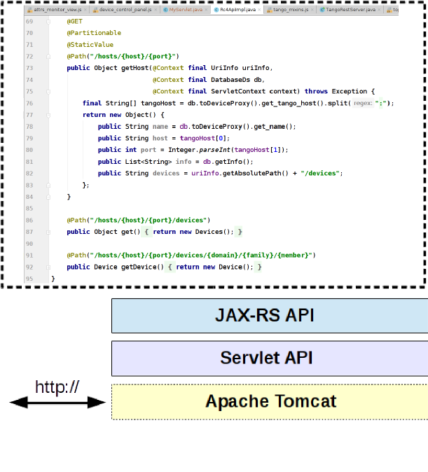
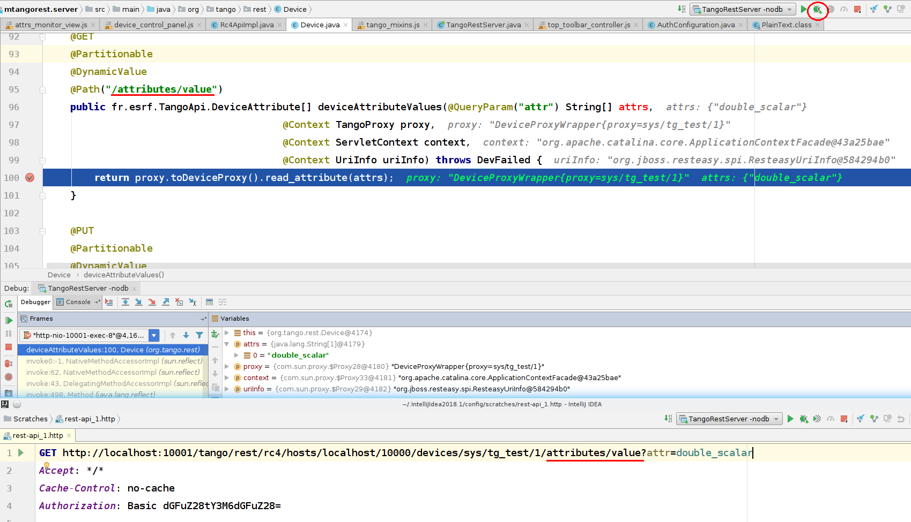

<a href="https://github.com/tango-controls/waltz"></a>

## Developing a waltz widget with UI

> **Sample project:** [hzg-wpi/beamtimedb-waltz-plugin](//github.com/hzg-wpi/beamtimedb-waltz-plugin)

1. Generate a new repo from [waltz-controls/waltz-webpack-plugin](//github.com/waltz-controls/waltz-webpack-plugin)
      - one may want to fork the repo into your organization first
2. Replace all XXX occurances in `package.json`, `README.md`
      - one may need to adjust GitHub organizations as well e.g. `@waltz-controls` -> `@my-org` (also in `.npmrc`)
3. Add you code into `src`
      - `src/index.js` can be used to define plugin exports only e.g. constants, re-export classes from other source files etc
         ```js
         //./src/index.js
         export const kMyConstant = 'some constant';
         export {MyWidget} from 'src/widget/my';
         ```
4. Add some tests
5. Generate documentation ... basically do normal development cycles
5. Build, package and publish:
      - `npm run clean`
      - `npm run module`
      - `npm publish`
      - `git tag {version} & git push --tags`
6. Integrate new widget/plugin into Waltz:
      - branch `waltz-controls/waltz` 
      - install your published package
      - integrate your widget/plugin i.e. in `main.js`
      - build and deploy


> **WARNING**: This part of the documentation is out of date and corresponds to Waltz v0.6.x! Please feel free to contribute.

[TOC]

We shall start this developer guide with a super short introduction to the basic web technologies which are used in Waltz. 
If you don't need this, please, skip this part and go directly to the Waltz description.

## Short introduction to the basics of Web
Let's start with Client-Server architecture which looks like this at the first glance.


In our case we consider Browser as a Client and if we deep a bit, we get:


Browser via sends HTTP request to a specific URL. 
Server returns HTTP response that represents static/dynamic data on a local server system.

For example, Request URL “http:localhost:8080/jsTangORB/” means jsTangORB folder on the Server which returns as response index.html 


_Apache Tomcat_ (a Java HTTP web server environment) and _Servlet_ (a Java program that extends the capabilities of a server) 
are both middleware. Apache Tomcat binds itself to HTTP port and Servlet transforms API, 
so you don't need to keep in mind socets and ports.


_REST API_ is philosophy, a set of constraints.

It uses structured requests:
* http://{host}/{app}/{api}/{version}/{collection} e.g. http://localhost:8080/my-app/users
* http://{host}/{app}/{api}/{version}/{collection}/{item} e.g. http://localhost:8080/my-app/users/123
* http://{host}/{app}/{api}/{version}/{collection}/{item}/{sub-collection}

It adds semantic to HTTP methods:
* GET → get resource
* POST → create new resource
* PUT → update resource
* DELETE → remove resource


JAX-RS –  is a Java programming language API specification for server/client side REST implementation. 
Using previous diagrams JAX-RS will take the following place (note annotations on the code):


**Tango REST API is a RESTful view on Tango Controls.** It is just a SPECIFICATION!!!
http://{host}/{app}/{api}/{version}/{collection}/{item}/{sub-collection} → http://host/tango/rest/rc4/hosts/tango_host/10000/devices

So putting it all together, we get the following diagram:


## Waltz

From the developer point of view it is important to understand the following: Waltz per se is a web application built on top of WaltzPlatform. WaltzPlatform is a framework for Tango web applications (the framework may be extended to non-Tango applications as well, see architecture).

### Waltz application

Waltz application is a web application built using WaltzPlatform. Waltz is distributed as .war file.

### WaltzPlatform

WaltzPlatform is a framework on top of JavaScriptMVC-1.5.x and webix. WaltzPlatform provides building blocks (API, UI components) for developing custom web applications. WaltzPlatform uses Tango REST as one of the backends and therefore allows interaction with Tango Controls.

WaltzPlatform can be extended to non-Tango backends as well:

   

WaltzPlatform is distributed as git repository (forks or source code archive)

Waltz itself consists of 2 parts: platform and end user UI. If you need, you can extent platform part, e.g.  at the moment Waltz has Tango Controls data source, but it can be extended to EPICS.

Frankly speaking, as a frontend developer you don't need to know the server part. Here we would like to give you a short overview to let you know how it is organized:

### WaltzPlatform Tango REST backend (mTangoREST.server)
[mTangoREST.server](https://github.com/ingvord/mtangorest.server) - is a Java implementation of a Tango Controls REST API specification. If you need C++ version, please, visit [RestDS](http://tangodevel.jinr.ru/git/tango/web/RestDS) page.

mTangoREST.server has [two distributions](https://github.com/Ingvord/mtangorest.server/releases): .jar and .zip

The difference is shown in the following diagram:


A high level overview is presented in C&C diagrams.


**.jar**
* For development/small production deployment
* Standalone Tango device 
* Integration with standard Tango tools (Astor)
* Using launch script
* Dokerized

**.war**
* For production deployment:
    - Allows fine Tomcat tuning
    - High load (1K-10K users)
    - Standard enterprise infrastructure
* Embedded Tango device 
    - Configuration in WEB-INF/web.xml


Pipeline of the mTangoREST.server request can be presented like this:

Where 
* org.tango.web.server.filters; 

** org.tango.web.server.providers;

*** org.tango.web.server.resolvers, org.tango.web.server.interceptors.

Tango JAX-RS resources - Tango entities (aka device, attribute, commands etc) in mTangoREST.server.
The examples of code structure and Device class are below:


If you debug Device.java class, you will see that URL maps onto the method via annotation in the class:


Deployment should be done by system administrators. Below you can see how it was done in ESRF and DESY.


## Getting started as a developer

Make sure you have installed all the requirements. See [Installation guide](../installation_guide)

You may want to skip this section and jump to [WaltzPlatform reference guide](#waltzplatform-reference-guide)

### Developing custom dashboard for Waltz (ex. TangoWebapp)

In this section we will, first, develop a new widget (Dashboard) and integrate it into Waltz. Next, we will create a small custom application with this dashboard.

#### Adding a new widget

1. Create new _.js_ file in resources/webix_widgets and name it **my_dashboard.js**

2. Copy'n'Paste the following code into the newly created file:

```javascript
/**
 * @module MyDashboard
 */
(function(){
    //this function is private to this module
    var newPlotWidget=function(){
        return {
            gravity: 3,
            template: "template"
        }
    };

    /**
     * @type {webix.protoUI}
     */
    var my_dashboard = webix.protoUI(
        {
            name: 'my_dashboard',
            /**
             * @return {webix.ui}
             * @private
             */
            _ui:function(){
                return {
                    rows:[
                        {},
                        {
                            gravity: 3,
                            cols:[
                                {},
                                //call of the functuon. It is a good idea to move parts of the UI to a dedicated functions
                                newPlotWidget(),
                                {}
                            ]
                        },
                        {}
                    ]
                }
            },
            /**
             *
             * @param config
             * @constructor
             */
            $init:function(config){
                //extend client config with this widget's ui
                webix.extend(config, this._ui());
                //add some after construction logic
                this.$ready.push(function(){
                    webix.message("My dashboard has been initialized!")
                }.bind(this));//very important to bind function to a proper this object
            }
        }
    // webix.IdSpace is required to isolate ids within this component
    , webix.IdSpace, webix.ui.layout);//this component extends webix layout -- an empty view

    //this function will be available globally i.e. exports our dashboard
    newMyDashboard = function(config){
        return webix.extend({
            view: 'my_dashboard'
        }, config);
    }
})();
```

Here we have created a webix.protoUI _my_dashboard_ -- a stub for a smart component of our new dashboard that extends webix layout. We also extends its functionality injecting _webix.IdSpace_ mixin.

**READ MORE**:

[1] [webix.protoUI](https://docs.webix.com/desktop__custom_component.html)

[2] [webix.ui.layout](https://docs.webix.com/api__refs__ui.layout.html)

[3] [webix mixins -- building blocks for existing and new components](https://docs.webix.com/api__toc__ui_mixins.html)

[4] [webix.IdSpace](https://docs.webix.com/api__refs__idspace.html)


3. Next, we need to register our new dashboard among other platform widgets. For this open **setup.js** in resources/webix_widgets and add `'my_dashboard'` to the array of webix files:

```javascript
//file: resources/webix_widgets/setup.js

TangoWebappPlatform.ui = {
    _webix_files: [
        //...
        "attrs_monitor_view","device_monitor_view","scripting_console",
        "my_dashboard" //<!-- add this
    ]
};
```

This array is a list of widgets that are used in the application.

_setup.js_ is required due to limitation of Nashorn (see upcoming presentation)

4. Finally, lets add our dashboard to Waltz. Open **main_controller.js** in controllers/tango_webapp. And edit its _buildUI_ function:

```javascript
//file: controllers/tango_webapp/main_controller.js

    buildUI: function (platform_api) {
            //...

            ui_builder.set_right_item(TangoWebapp.ui.newDeviceControlPanel(platform_api.context));
            //add this to buildUI function -->
            ui_builder.add_mainview_item(
                {
                    header: "<span class='webix_icon fa-dashboard'></span> My Dashboard",
                    borderless: true,
                    body: newMyDashboard({id: 'my_dashboard'})
                });
            //<--
```

5. Run Tomcat in IntelliJ IDEA (if not yet started and be sure REST is started) and check the result:


**IMPORTANT**: run Tomcat from IntelliJ IDEA, **NOT** from Terminal. Otherwise Tomcat won't update sources and may not deploy proper application at all.

#### adding plot to the new widget

1. Replace _newPlotWidget_ function from the previous part with the following:

```javascript
    //file: resources/webix_widgets/my_dashboard.js

    //this function is private to this module
    var newPlotWidget=function(){
        return TangoWebapp.ui.newImageView({
            id:'mydashboard.plot',
            gravity: 3
        });
    };
```

Here we use existing _ImageView_ from Waltz platform. In the next step we will add data to it.

2. Let's update our _PlotWidget_ every second. Add this code to _$ready.push(function(){...})_ in my_dashboard.js. 

**NOTE** Change `localhost` to what you have in Waltz if your Tango Host name differs.

**NOTE** Be sure your `sys/tg_test/1` device is exported. If not, execute `/usr/lib/tango/TangoTest test` in Terminal where your Tango Controls locates.


```javascript
    //file: resources/webix_widgets/my_dashboard.js#$init

    //store our plot widget reference for later use
    var plot = $$(this).$$('mydashboard.plot');
    //store attr promise for later use
    var attr = PlatformContext.rest.fetchHost('localhost:10000')
        .then(function(host){
            return host.fetchDevice('sys/tg_test/1');
        }).then(function (device) {
            return device.fetchAttr('double_image_ro')
        });
    //builtin JS function. It will execute attr.read every 1000 ms
    setInterval(function(){
        attr.then(function(attr){
                return attr.read();
            })
            .then(function(value){
                plot.update(value);
            })
            .fail(function(err){
                TangoWebappHelpers.error("Could not read attribute", err);
            });
    }.bind(this),1000);
```

**Read more**

[1] [webix.promise](https://docs.webix.com/helpers__ajax_operations.html#promiseapiforajaxrequests)

3. Check the result. Switch to Firefox and refresh the page (`F5`):


#### Further improvements

1. Use _Runnable_ mixin to perform the routine. Mixin - a block of code that lets us group declarations we may reuse.  

**Inject** _TangoWebappPlatform.mixin.Runnable_ into _my_dashboard_ view:

```javascript
    //file: resources/webix_widgets/my_dashboard.js#my_dashboard

    //code line # ~76
    , TangoWebappPlatform.mixin.Runnable, webix.IdSpace, webix.ui.layout);//<-- add TangoWebappPlatform.mixin.Runnable
```

2. Insert _run_ method before `$init:function(config){...}`.

```javascript
    //NEW CODE HERE!!!
    run:function(){
        var $$plot = $$(this).$$('mydashboard.plot');
        //note this.
        this.attr.then(function(attr){
                return attr.read();
            })
            .then(function(value){
                $$plot.update(value)
            })
            .fail(function(err){
                TangoWebappHelpers.error("Could not read attribute", err);
            })
    },
    /**
     *
     * @param config
     * @constructor
     */
    $init:function(config){
```


And we change the body of the ` this.$ready.push` function. 

Replace the `this.$ready.push` with following:

```javascript
        this.$ready.push(function(){
            //NOW STORE attr AS PROPERTY
            this.attr = PlatformContext.rest.fetchHost('localhost:10000')
                .then(function(host){
                    return host.fetchDevice('sys/tg_test/1');
                }).then(function (device) {
                    return device.fetchAttr('double_image_ro')
                });
            //start the routine
            this.start();//this function is defined in Runnable mixin
        }.bind(this));//very important to bind function to a proper this object
```

**NOTE** here we delete _setInterval_ in $ready function and add _run_ method:


Usage of _TangoWebappPlatform.mixin.Runnable_ will handle a number of situations for you. Like suspending the routine when the widget is not visible. To check this lets use Firefox dev tools:

3. Switch to Firefox and refresh the page (`F5`). Now open dev tools (`F12`) and switch to the _Network tab_:


You will notice a bunch of requests every second. If you switch to _Settings_ tab requests will cease to appear. This is because _TangoWebappPlatform.mixin.Runnable_ implements this functionality.

And of course it is a good practice to extract common functionality and re-use it. You can define your own mixins!!!

4. Using dev tools debugger. Very important feature and skill - to debug the code. Lets have a look what we get from the server when reading our attribute. Switch to _Debugger_ tab look for _my_dashboard.js_, put a break point and switch back to _My Dashboard_ tab in Waltz:


#### Add functional test

1. First generate a new test stub in your project root:

```bash
$>  ./jmvcc jmvc/generate/test functional test_my_dashboard
Generating ... test/functional/test_my_dashboard_test.js

              Done!


              Make sure to add to your application files!

$>
```

This command will add a new file in test/functional folder. Alter its content as follows:

```javascript
new Test.Functional('test_my_dashboard',{
   test_truth: function() {
       var dashboard = newMyDashboard({id:'my_dashboard_test'});
       webix.ui({
           view: 'window',
           close: true,
           width: 800,
           height:600,
           body: dashboard
       }).show();

       this.assert(true);
   }
});
```

In this test we will simply open a new webix window with our dashboard.

Now we need to enable this test and run the application in test mode:

**Read more**

[1] [webix.window](https://docs.webix.com/api__refs__ui.window.html)

2. Add `'test_my_dashboard'` line into apps/tango_webapp/test.js

```javascript
//file: apps/tango_webapp/test.js

include.functional_tests(
    //...
    'tango_webapp/attrs_monitor_view',
    'test_my_dashboard' //<!--
);
```

3. Enable test mode in apps/tango_webapp/index.html:

```html
<!-- file: apps/tango_webapp/index.html-->

<!--<script type="text/javascript" src="../../jmvc/include.js?tango_webapp,development"></script>-->
<script type="text/javascript" src="../../jmvc/include.js?tango_webapp,test"></script> <!-- replace development with test -->
```

4. Switch to Firefox and refresh the page (`F5`). A test console will popup. Wait until all tests are loaded, switch to _Functional_ tab, scroll to _my_dashboard_ test and run it:


The final version of the code for this exercise is available [here](https://github.com/tango-controls/tango-webapp/pull/140)

[Live demo >>](http://ec2-35-156-104-8.eu-central-1.compute.amazonaws.com:8080/workshop-solaris-1)

### Developing custom application using Waltz (ex. TangoWebapp) platform

1. Create new jmvc app in the project root:

```
$> ./jmvcc jmvc/generate/app my_app
               apps/my_app
Generating ... apps/my_app/compress.js
               apps/my_app/index.html
               apps/my_app/run_unit.js
               apps/my_app/test.js
               apps/my_app.js
               controllers/my_app/main_controller.js

Make sure to add new files to your application and test file!
$>
```

2. Set up dependencies. Add `include('platform')` and webix widgets to apps/my_app.js :

```javascript
//file: apps/my_app.js

include('platform')

//...
include(function(){
    //...
    //webix widgets
    include.resources(
        "webix_widgets/setup"
    );
});
```

3. Enable plotly library as it is required for plots. Uncomment plotly in _index.html_:

```html
<!--file: apps/my_app/index.html -->

<!--<script type="text/javascript" src="https://cdn.plot.ly/plotly-latest.js"></script>-->
<!-- uncomment plotly -->
<script type="text/javascript" src="https://cdn.plot.ly/plotly-latest.js"></script>
```

4. Replace _main_controller.js#load_ function with _buildUI_ in controllers/my_app/main_controller.js:

```javascript
//file: controllers/my_app/main_controller.js

//replace load function
buildUI: function(platform){
    var ui_builder = platform.ui_builder;

    ui_builder.add_mainview_item({
        header: "<span class='webix_icon fa-dashboard'></span> My Dashboard",
        borderless: true,
        body: newMyDashboard({id: 'my_dashboard'})
    });
}
```
5. Check the result. Switch to Firefox and navigate to `http://localhost:8080/WaltzDev/apps/my_app/index.html`

**NOTE** `my_app` in the link


#### Packaging application

Packaging. Create _assemble_ script in the project root folder:

```
var buildDir = "build/work";
$EXEC("ant -f jmvc/ant/build.xml build -Dapp=platform -DbuildDir=${buildDir}")
echo($OUT)
echo($ERR)
if($EXIT !== 0) exit($EXIT)

$EXEC("ant -f jmvc/ant/build.xml build -Dapp=my_app -DbuildDir=${buildDir}")
echo($OUT)
echo($ERR)
if($EXIT !== 0) exit($EXIT)

$EXEC("ant -f jmvc/ant/build.xml compress-and-move -Dapp=my_app -DbuildDir=${buildDir}")
echo($OUT)
echo($ERR)
if($EXIT !== 0) exit($EXIT)

$EXEC("ant -f jmvc/ant/build.xml copy-webapp -DbuildDir=${buildDir}")
echo($OUT)
echo($ERR)
if($EXIT !== 0) exit($EXIT)

$EXEC("ant -f jmvc/ant/build.xml war -DbuildDir=${buildDir}")
echo($OUT)
echo($ERR)
if($EXIT !== 0) exit($EXIT)
```

And run it: `$> ./jmvcc assemble`

The following output indicates successful execution:

```
...
war:
      [zip] Building zip: /storage/Projects/hzg.wpn/mTangoSDK/tango-webapp/build/distributions/TangoWebapp.war

BUILD SUCCESSFUL
Total time: 0 seconds
$>
```

`build/distributions/TangoWebapp.war` file can now be deployed to tomcat. But it is a good idea to automatize this process. See next section.


#### Continuous integration

1. Move _assemble_ script to jmvc/ folder. Now Travis will automatically build my_app every time new code is pushed to GitHub.

#### Applying custom styles

1. Go to the webix skin builder [link](https://webix.com/skin-builder/):


2. Play with different style themes. We will choose _material_ and adjust background color/view color and download the resulting theme:


3. Unpack downloaded archive into stylesheets folder and enable the new skin in _index.html_ (apps/my_app folder) adding:

```html
<!-- file: apps/my_app/index.html -->

<!--<link rel="stylesheet" href="https://cdn.webix.com/5.2/skins/aircompact.css" type="text/css">-->
<link rel="stylesheet" href="https://cdnjs.cloudflare.com/ajax/libs/font-awesome/4.7.0/css/font-awesome.min.css">
<link rel="stylesheet" href="../../stylesheets/webix.css" type="text/css">

<!-- ... -->
<script type="text/javascript" src="https://cdn.webix.com/5.2/webix_debug.js"></script>
<script type="text/javascript" src="../../stylesheets/skin.js"></script><!-- add this -->
```

4. Check the result:


**Read more**

[1] [webix skins](https://docs.webix.com/desktop__skins.html)

Final code for this exercise can be found [here](https://github.com/tango-controls/tango-webapp/pull/141)

[Live demo >>](http://ec2-35-156-104-8.eu-central-1.compute.amazonaws.com:8080/workshop-solaris-2/apps/my_app/index.html)

### Advanced exercise

#### Data binding 

Automatically switch data source for our widget when user clicks on an image attribute in the Device tree view

#### Responsive design

Test application for design responsiveness using dev tools

## WaltzPlatform reference guide

WaltzPlatform is a framework for building Tango web applications. Waltz application is such application.

WaltzPlatform from the developer point-of-view is a bunch of jmvc applications, backend and widgets. 


Project structure is defined by [javascriptmvc-1.5.x](https://github.com/jmvc-15x/javascriptmvc-1.5.x) (jmvc) framework.

Each jmvc application has the following:


* include.js
* JS inheritance emulation
* documentation auto generation
* test console where you can run Unit tests. You can test widget(s) separately.
* packaging
* OpenAjax for loose coupling

WaltzPlatform module diagram:


### High level architecture overview

Waltz implements classical 3-tiers architecture:


Where __data access layer__ is _Transport_. __Functional layer__ is PlatformAPI i.e. UI-less part of the WaltzPlatform. 
Finally __UI layer__ is _webix_widgets_ i.e. smart components included into WaltzPlatform that can be used as building blocks 
for custom applications/widgets built on top of WaltzPlatform.

### WaltzPlatform API

Important part of the WaltzPlatform is its API. Waltz Platform API has the following parts:

#### UIBuilder

UIBuilder provides API to build UI of the application based on WaltzPlatform. Below is an example of using UIBuilder to build Waltz application UI:  


UIBuilder supports customization of all 5 panels, as well as not using some of the panels. Below is an example of an application that uses only main view panel:


Full UIBuilder API reference: [link]()

#### Tango device model

WaltzPlatform provides high level API of the Tango devices model e.g. TangoDevice.

Full API reference of the Tango device model can be found here: [link]()

#### Tango REST API js adapter

WaltzPlatform provides API to Tango REST. TangoRest API implements builder pattern:


#### Utility models and helpers

##### PlatformContext

Context of the application. 

Full API reference: [link]()

##### UserContext

Developer may store custom data per user basis using UserContext API. UserContext has _ext_ field that can store any data. UserContext may be backed by a dedicated backend to persist the data (for instance, [UserContextBackend](https://github.com/tango-controls-waltz/tango-webapp-user-context)). By default all the data is stored in-memory DB provided by WaltzPlatform.

To specify UserContext backend provide env argument to assemble command:


Full UserContext API reference: [link]()

##### include.js

include.js is a part of jmvc. include.js is used to define dependencies of the application:


##### JS inheritance

WaltzPlatform provides a number of models that can be extended using jmvc inheritance feature:


##### webix widgets

WaltzPlatform uses [webix](http://webix.com) for UI components and data binding.

Data binding allows dynamic update of the components bound to each other:  


All WaltzPlatform widgets are implemented as [webix.protoUI](https://docs.webix.com/desktop__custom_component.html)s:


Please read webix documentation to become familiar with protoUI.

Full webix widgets API reference: [link]()

##### webix mixins

Mixin is another way (comparing to inheritance) to extrend JS object's functionality. WaltzPlatform provides a number of mixins that can be used to extend custom widgets: 


#### OpenAjax events

WaltzPlatform uses OpenAjax event bus to loose coupling between components and to allow customizations. 

jmvc provides convenient way to declare subscription to an OpenAjax event: 

 

The following events are supported by WaltzPlatform:

##### platform_context.create

Fires when PlatformContext is being created 

##### platform_context.destroy

Fires when PlatformContext is being destroyed i.e. user logs off.

##### platform_context.set_rest

Fires when TangoRest instance is being injected into PlatformContext

##### platform_context.set_user_context

Fires when UserContext instance is being injected into PlatformContext

##### tango_webapp.tango_host_loaded

Fires when new TangoHost has been loaded

##### tango_webapp.rest_send

Fires when new Tango REST request is being sent

##### tango_webapp.rest_failure

Fires when new Tango REST request has failed

##### tango_webapp.rest_success

Fires when new Tango REST request has succeed

##### tango_webapp.device_loaded

Fires when new TangoDevice has been loaded

##### tango_webapp.device_open

Fires when user clicks on _open_ in DevicesTree context menu

##### tango_webapp.device_configure

Fires when user clicks on _configure_ in DevicesTree context menu

##### tango_webapp.device_delete

Fires when user clicks on _delete_ in DevicesTree context menu

##### tango_webapp.device_view

Fires when user clicks on _delete_ in DevicesTree context menu

##### tango_webapp.device_view.update_attr_config

Fires when user updates device's configuration

tango_webapp.attr_
##### tango_webapp.attr_add_to_monitor

Fires when user adds a new attribute to Dashboard

tango_webapp.item_selected

tango_webapp.database_loaded

##### user_action.log

Fires when user action is being logged

##### platform_api.ui.initialized

Fires when UI has been built

##### platform.user_logout

Fires when user logs out

##### user_context.create.as_existing

Fires when new UserContext instance is being created

##### user_context.destroy

Fires when new UserContext instance is being destroyed

##### user_context_controller.found

Fires when UserContext instance for given user has been found

##### user_context_controller.update

Fires when UserContext instance is being updated

##### user_context_controller.destroy

Fires when UserContext instance is being destroyed

##### user_context_controller.add_tango_host

Fires when new TangoHost instance is being injected into UserContext instance

##### user_context_controller.delete_tango_host

Fires when new TangoHost instance is being deleted from UserContext instance

##### tango_rest_api.is_alive

Fires when new Tango REST server responds

##### tango_rest_api.is_not_alive

Fires when new Tango REST server does not respond

## Unit and functional testing

Developer should write unit and functional tests to achieve better user experience with the application. WaltzPlatform applications can be switched to _test_ mode:


In this mode test console will appear (if not - make sure the popups are not blocked in your browser). Use this console to run unit/functional tests.

Refer to [add functional test](#add-functional-test) for more info on how to setup _test_ mode. 

To add unit test follow the procedure but use __unit__ key word instead of __functional__ e.g. `./jmvcc jmvc/generate/test unit my_unit_test`

## Packaging and deployment

Using jmvc console utility program developer can package WaltzPlatform based applications into production ready .war files: `./jmvcc jmvc/assemble`


When application is beaing packaged all the .js files are assembled into a single assembly.js file and then "compiled" by Google Closure compiler into production.js. In addition all resources (images, css etc) are packed into a single .war file. This .war file may be deployed into production.

Below is an example of a deploy script that is run by Travis CI:


__NOTE:__ in the script above resulting .war file is renamed after current repository branch name.

Refer to [packaging application](#packaging-application) and [continous intergation](#continuous-integration) sections for more details.

//TODO

Waltz_code_webixProtoUI+composition.png
Waltz_extention.png
Waltz_high_level_module_diagram.png
Waltz_jar_distribution.png
Waltz_module_diagram.png
Waltz_packaging.png
Waltz_packaging1.png


Waltz_war_distribution.png
Waltz_code_data_binding.png


Waltz_code_JSDoc.png

Waltz_code_platformAPI_StatefulMixin.png

## How to...

Update stored UserContext

```bash
$> cd ${USER_CONTEXT_DATA}
$> cp p05user p05user.bak
$> base64 --decode p05user
$> {EDIT UserContext}
$> nano p05user.json
$> curl -X POST -d "id=p05user&data=`base64 p05user.json`" https://hzgxenvtest.desy.de:8443/user-context/cache
```

## Resources

[1] [Exploring JS](http://exploringjs.com/)

[2] [Waltz platform API references](https://tango-controls.github.io/waltz/)

[3] [JavaScriptMVC-1.5.x API references](https://jmvc-15x.github.io/docs/)

[4] [webix documentation](https://docs.webix.com/desktop__overview.html)

[5] [Full stack introduction (video)](https://rutube.ru/video/00d518e2aa8958b891430fbdf24f270a/)
