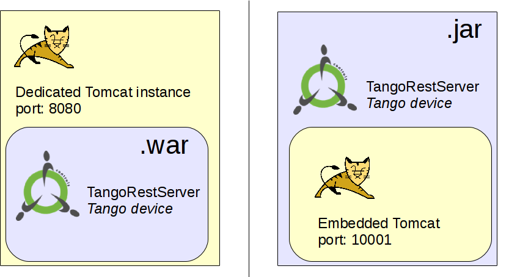

<a href="https://github.com/tango-controls/waltz"></a>

## Short introduction to the basics of Web

We shall start this developer guide with a super short introduction to the basic web technologies which are used in Waltz. 
If you don't need this, please, skip this part and go directly to the Waltz description.

Let's start with Client-Server architecture which looks like this at the first glance.


In our case we consider Browser as a Client and if we deep a bit, we get:


Browser via sends HTTP request to a specific URL. 
Server returns HTTP response that represents static/dynamic data on a local server system.

For example, Request URL “http:localhost:8080/jsTangORB/” means jsTangORB folder on the Server which returns as response index.html 


_Apache Tomcat_ (a Java HTTP web server environment) and _Servlet_ (a Java program that extends the capabilities of a server) 
are both middleware. Apache Tomcat binds itself to HTTP port and Servlet transforms API, 
so you don't need to keep in mind socets and ports.


_REST API_ is philosophy, a set of constraints.

It uses structured requests:
* http://{host}/{app}/{api}/{version}/{collection} e.g. http://localhost:8080/my-app/users
* http://{host}/{app}/{api}/{version}/{collection}/{item} e.g. http://localhost:8080/my-app/users/123
* http://{host}/{app}/{api}/{version}/{collection}/{item}/{sub-collection}

It adds semantic to HTTP methods:
* GET → get resource
* POST → create new resource
* PUT → update resource
* DELETE → remove resource


JAX-RS –  is a Java programming language API specification for server/client side REST implementation. 
Using previous diagrams JAX-RS will take the following place (note annotations on the code):


**Tango REST API is a RESTful view on Tango Controls.** It is just a SPECIFICATION!!!
http://{host}/{app}/{api}/{version}/{collection}/{item}/{sub-collection} → http://host/tango/rest/rc4/hosts/tango_host/10000/devices

So putting it all together, we get the following diagram:


## Waltz

From the developer point of view it is important to understand the following: Waltz per se is a web application i.e. requires knowledge of NodeJS, JavaScript (ES6), webpack and rollup. Waltz application is built using Webpack and distributed as a .war file.

## Waltz developer guide

To develop GUI applications based on Waltz one has to set up an *npm* registry first: 

1. `npm install` may require authorization ([How to setup GitHub npm](https://help.github.com/en/packages/using-github-packages-with-your-projects-ecosystem/configuring-npm-for-use-with-github-packages))
      - add github npm registry to `~/.npmrc`:
        ```
        //npm.pkg.github.com/:_authToken={YOUR_GITHUB_AUTH_TOKEN}
        ```

### Waltz modules

Waltz consist of a number of modules, distributed via npm GitHub registry under @waltz-controls scope.

Most important modules are:
 - [Waltz-Middleware](https://github.com/waltz-controls/middleware)
 - [Tango-Rest-plugin](https://github.com/waltz-controls/waltz-tango-rest-plugin)
 - [UserContext-plugin](https://github.com/waltz-controls/waltz-user-context-plugin)
 
All together these modules provide building blocks and are used in Waltz application. Waltz uses Tango REST as one of the backends and therefore allows interaction with Tango Controls.

Waltz can be extended to non-Tango backends as well:

   

Frankly speaking, as a frontend developer you don't need to know the server part. Here we would like to give you a short overview to let you know how it is organized.

### Developing a waltz widget with UI

> **Sample project:** [hzg-wpi/beamtimedb-waltz-plugin](//github.com/hzg-wpi/beamtimedb-waltz-plugin)

1. Generate a new repo from [waltz-controls/waltz-webpack-plugin](//github.com/waltz-controls/waltz-webpack-plugin)
      - one may want to fork the repo into your organization first
2. Replace all XXX occurances in `package.json`, `README.md`
      - one may need to adjust GitHub organizations as well e.g. `@waltz-controls` -> `@my-org` (also in `.npmrc`)
3. Add you code into `src`
      - `src/index.js` can be used to define plugin exports only e.g. constants, re-export classes from other source files etc
         ```js
         //./src/index.js
         export const kMyConstant = 'some constant';
         export {MyWidget} from 'src/widget/my';
         ```
4. Add some tests
5. Generate documentation ... basically do normal development cycles
5. Build, package and publish:
      - `npm run clean`
      - `npm run module`
      - `npm publish`
      - `git tag {version} & git push --tags`
6. Integrate new widget/plugin into Waltz:
      - branch `waltz-controls/waltz` 
      - install your published package
      - integrate your widget/plugin i.e. in `main.js`
      - build and deploy


### waltz-tango-rest-plugin backend

[TangoRestServer](https://github.com/tnago-controls/rest-server) - is a Java implementation of a [Tango Controls REST API specification](https://github.com/tango-controls/rest-api).

TangoRestServer has [two distributions](https://github.com/tnago-controls/rest-server): .jar and .zip

The difference is shown in the following diagram:


A high level overview is presented in C&C diagrams.


**.jar**
* For development/small production deployment
* Standalone Tango device 
* Integration with standard Tango tools (Astor)
* Using launch script
* Dokerized

**.war**
* For production deployment:
    - Allows fine Tomcat tuning
    - High load (1K-10K users)
    - Standard enterprise infrastructure
* Embedded Tango device 
    - Configuration in WEB-INF/web.xml


Pipeline of the mTangoREST.server request can be presented like this:

Where 
* org.tango.web.server.filters; 

** org.tango.web.server.providers;

*** org.tango.web.server.resolvers, org.tango.web.server.interceptors.

Tango JAX-RS resources - Tango entities (aka device, attribute, commands etc) in mTangoREST.server.
The examples of code structure and Device class are below:


If you debug Device.java class, you will see that URL maps onto the method via annotation in the class:


Deployment should be done by system administrators. Below you can see how it was done in ESRF and DESY.


### other required backends

For Waltz to be fully functional the following backends must be deployed:

- [UserContext](https://github.com/waltz-controls/user-context) 

- [Magix](https://github.com/waltz-controls/magix-war-plugin)

These backends are distibuted as .war files and hence must be deployed together with TangoRestServer to a JavaEE server (Apache Tomcat). 

## Packaging and deployment

Waltz uses Webpack to build a .war file distribution:

1. `npm run clean`

2. `npm run war`

Once the .war file is built it can be deployed to Tomcat or any other JavaEE server. 

## How to...

Update stored UserContext

```bash
$> cd ${USER_CONTEXT_DATA}
$> cp p05user p05user.bak
$> base64 --decode p05user
$> {EDIT UserContext}
$> nano p05user.json
$> curl -X POST -d "id=p05user&data=`base64 p05user.json`" https://hzgxenvtest.desy.de:8443/user-context/cache
```

## Resources

[1] [Exploring JS](http://exploringjs.com/)

[2] [Waltz platform API references](https://tango-controls.github.io/waltz/)

[3] [JavaScriptMVC-1.5.x API references](https://jmvc-15x.github.io/docs/)

[4] [webix documentation](https://docs.webix.com/desktop__overview.html)

[5] [Full stack introduction (video)](https://rutube.ru/video/00d518e2aa8958b891430fbdf24f270a/)
