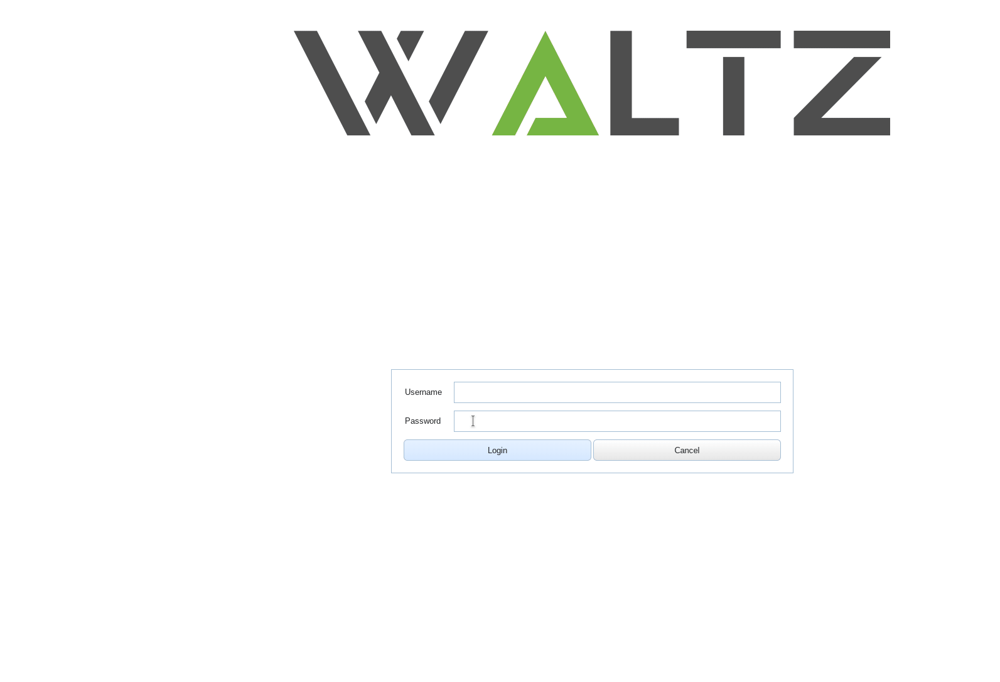

A general purpose Tango web application that provide the interface between the Tango control system and the scientific users who define and calibrate their experiments. It first had a name of TangoWebapp but on the Tango Users Meeting 32 during the voting it gained its name as Waltz. So if you find something about TangoWebapp just know that it is the same project.

Waltz was designed as a platform on top of which web application was built. The reason of developing the application was the idea to give some “freedom” to the beamline scientists, e.g. to give:

- → Convenient remote access (possibility to track the experiment outside the control room)
- → Integrated Tango tools
- → Powerful monitoring
- → Scripting

It is a general purpose application – you can browse devices, read and write attributes, pipes, monitor and configure (polling, adding, deleting).

Speaking about Waltz you should understand that

- → Each Beamline may have its own instance of Waltz;
- → Each Beamline may have its own custom Dashboard;
- → Each Beamline may have 100% custom Web application ontop of Waltz platform.

In general, you or DevOps install Waltz in the Beamline (which obviously should have Tango Controls), get all the credentials from sysadmins and can check what is going on in you Beamline accessing it in browser from any part of the world. The configuration options (e.g. hosts, devise filters, monitored attributes) and scripts are saved per user bas.

Documentation is divided into three parts:

- [Users guide](user_guide.md) 
- [Developers guide](developer_guide.md)  
- [Installation guide](installation_guide.md)

Waltz is a combined effort of:
<!--float: left; -->

