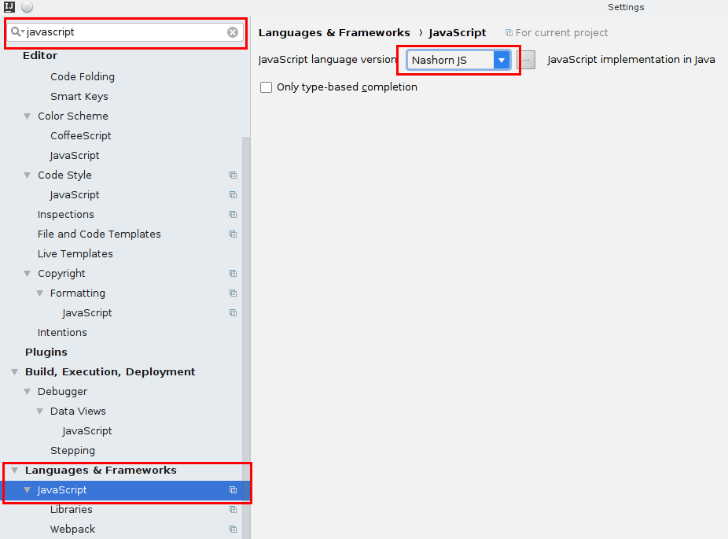
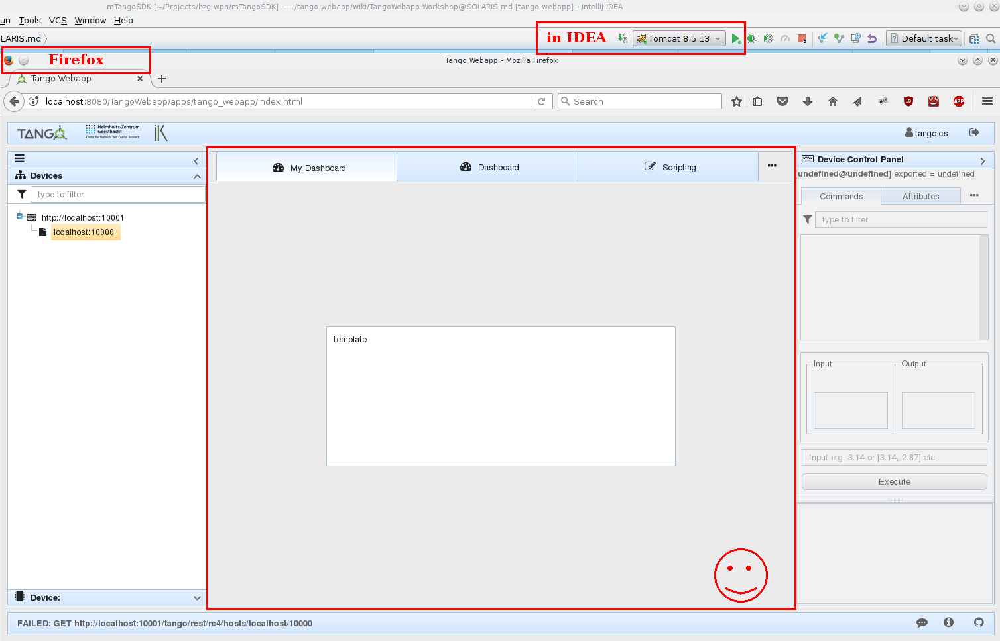
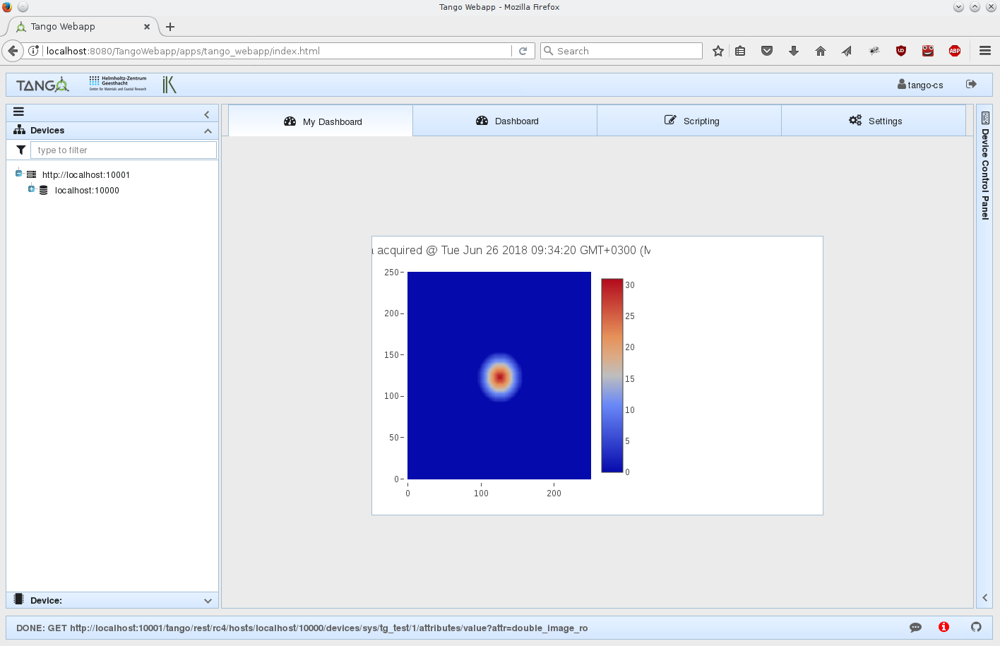
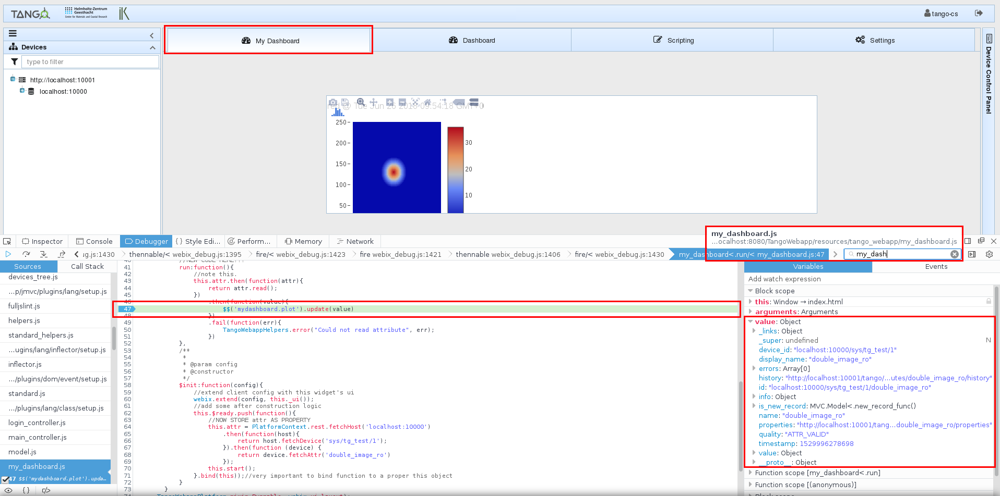
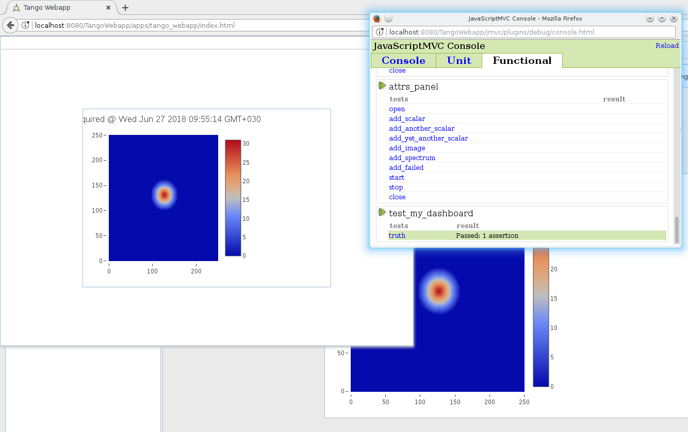
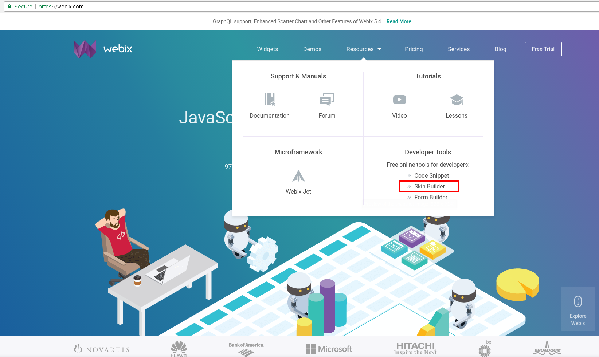
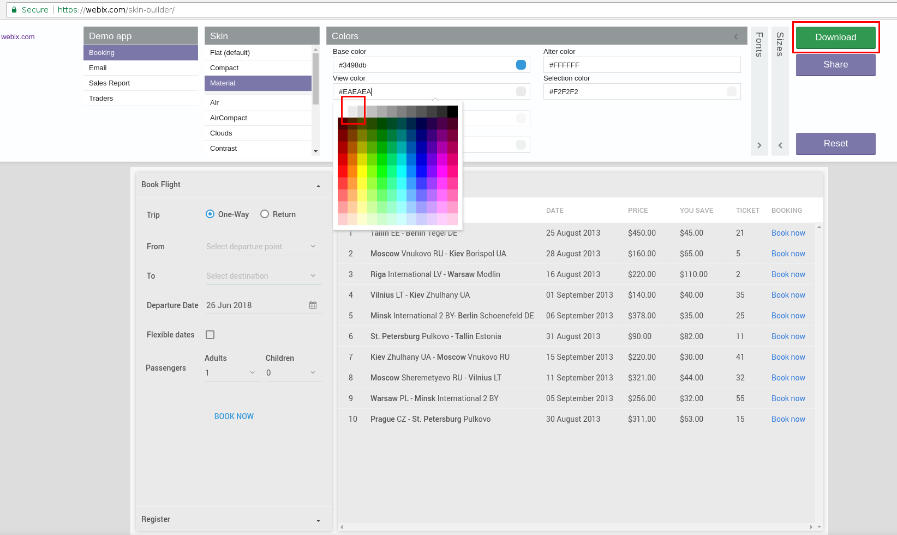
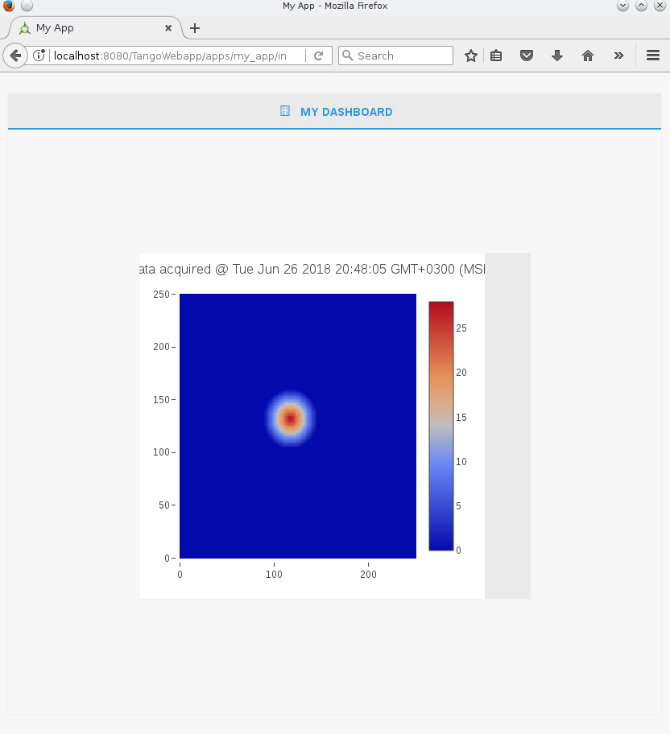

# Installation and tutorial

## Slides

1. [Introduction](https://www.slideshare.net/secret/bGqura3owiyMtn)

2. [Web/REST](https://www.slideshare.net/secret/bYRV0WRw24jotN)

3. [Tango REST Server - mtangorest.server](https://www.slideshare.net/secret/pZioNqZIp6lToV)

4. [Waltz (ex. TangoWebapp) aka client](https://www.slideshare.net/secret/LyqxvOpgy7gbJd)

## Prerequisites

1. Install OpenJDK-8 -- Java Development Kit. For Debian/Ubuntu:
```
$> sudo apt-get install openjdk-8-jdk
...
$> java -version
openjdk version "1.8.0_162"
OpenJDK Runtime Environment (build 1.8.0_162-8u162-b12-1~bpo8+1-b12)
OpenJDK 64-Bit Server VM (build 25.162-b12, mixed mode)
```

# I. mTangoREST.server installation guide

__If you use Windows__, visit Tango docs page with [Waltz (ex. TangoWebapp) installation tutorial](http://tango-controls.readthedocs.io/en/latest/tutorials-and-howtos/tutorials/install-tango-webapp.html)

__If you use Linux__, follow next steps.

1. Download [mTangoREST.server-rc4-2.7.jar](https://github.com/Ingvord/mtangorest.server/releases/download/mtangorest.server-rc4-2.7/mtangorest.server-rc4-2.7.jar). Save it in folder where you keep your Tango server executable files (possibly where Starter device can find it), e.g. /home/user/bin.
2. Next to the downloaded _.jar_ create a bash script with the name __TangoRestServer__ (this name is important for the future integration with Astor and other Tango tools) and put there

```bash
#!/bin/bash

echo "Using TANGO_HOST=$TANGO_HOST"

USERNAME=`whoami`
echo "Using USERNAME=$USERNAME"

#enable debug
JAVA_OPTS="-Xmx4G -Xshare:off -XX:+UseG1GC -agentlib:jdwp=transport=dt_socket,server=y,suspend=n,address=5009"
echo "Using JAVA_OPTS=$JAVA_OPTS"

/usr/bin/java -jar $JAVA_OPTS -DTANGO_HOST=$TANGO_HOST /home/$USERNAME/bin/mtangorest.server-rc4-2.7.jar -nodb -dlist test/rest/0
```

3. To make this file executable, in Terminal go to the folder and execute
```
$> chmod 777 TangoRestServer
```
4. Start Tango REST Server by
```
$> ./TangoRestServer
```
5. To test, open new Terminal and execute
```
curl -u "tango-cs:tango" http://localhost:10001/tango/rest/rc4
```


# II. Waltz (ex. TangoWebapp) installation guide

1. Download and extract [Apache Tomcat 8.5.31](https://tomcat.apache.org/download-80.cgi#8.5.31) (_.zip_ – for Windows, _.tar.gz_ – for Linux) in your folder with REST.

2. Download _.war_ file of [Waltz v0.4.2](https://github.com/tango-controls/tango-webapp/releases/download/v0.4.2/TangoWebapp.war) into /home/user/bin/apache-tomcat-8.5.31/webapps/

3. Start Tomcat in Terminal
```
$> cd apache-tomcat-8.5.31/bin/
$> ./startup.sh 
```
4. Open browser and go to http://localhost:8080/TangoWebapp
* login: tango-cs
* pass: tango

Get an error because have to connect to Tango Controls.

5. Set a valid Tango Host. In Waltz go to _Setting_ tab (1) -> _Tango hosts_ box -> put __your__ Tango host -> press "+" (2)


# III. IDE Setup

This section describes how to setup [IntelliJ IDEA Ultimate](https://www.jetbrains.com/idea/download/download-thanks.html?platform=linux) for developing using Waltz (ex. TangoWebapp) platform. Setup for other IDEs should be the same in general.

1. Clone Waltz (ex. TangoWebapp):
```
$> git clone git@github.com:tango-controls/tango-webapp.git
```

OR using https (if you have no github account):

```
$> git clone https://github.com/tango-controls/tango-webapp.git
```

This will create **tango-webapp** folder in the current folder.

2. Open intelliJ IDEA and start a new project using existing source (_File_ -> _New_ -> _Project from existing source..._) and choose cloned tango-webapp folder.

3. Add an artifact to your project: _File_ -> _Project Structure..._

Add a new artifact "+" -> _Web Application: Exploded_ and add **tango-webapp** as _Directory content_ to the artifact:


4. Once new project has been created let's setup Apache Tomcat. Select _Run_ -> _Edit configurations..._

Add a new local Tomcat run configuration:


Setup a new Tomcat application server - just add Apache Tomcat base folder (the one you extracted in _I. mTangoREST.server installation guide_)


Next you need to add TangoWebapp artifact to Tomcat: open _Deployment_ tab and add artifact:


Set context - this is what defines URL at which Waltz will be accessible e.g. `http://localhost:8080/WaltzDev`:


Finally switch back to _Server_ tab and choose _Update classes and resources_ on _Frame deactivation_:


the later will allow source update on the fly i.e. changes to _.js_ files will be fetched by Tomcat automatically once you switch to the browser.

5. Finally set JavaScript language flavour to Nashorn: _File_ -> _Settings..._ -> put _javascript_ into search box -> _Languages & Frameworks_ -> _JavaScript_ -> select _Nashorn JS_ in the drop-down list



Now IntelliJ IDEA is ready for development.

# IV. Developing custom dashboard for Waltz (ex. TangoWebapp)

In this section we will, first, develop a new widget (Dashboard) and integrate it into Waltz. Next, we will create a small custom application with this dashboard.

### Adding a new widget

1. Create new _.js_ file in resources/webix_widgets and name it **my_dashboard.js**

2. Copy'n'Paste the following code into the newly created file:

```javascript
/**
 * @module MyDashboard
 */
(function(){
    //this function is private to this module
    var newPlotWidget=function(){
        return {
            gravity: 3,
            template: "template"
        }
    };

    /**
     * @type {webix.protoUI}
     */
    var my_dashboard = webix.protoUI(
        {
            name: 'my_dashboard',
            /**
             * @return {webix.ui}
             * @private
             */
            _ui:function(){
                return {
                    rows:[
                        {},
                        {
                            gravity: 3,
                            cols:[
                                {},
                                //call of the functuon. It is a good idea to move parts of the UI to a dedicated functions
                                newPlotWidget(),
                                {}
                            ]
                        },
                        {}
                    ]
                }
            },
            /**
             *
             * @param config
             * @constructor
             */
            $init:function(config){
                //extend client config with this widget's ui
                webix.extend(config, this._ui());
                //add some after construction logic
                this.$ready.push(function(){
                    webix.message("My dashboard has been initialized!")
                }.bind(this));//very important to bind function to a proper this object
            }
        }
    // webix.IdSpace is required to isolate ids within this component
    , webix.IdSpace, webix.ui.layout);//this component extends webix layout -- an empty view

    //this function will be available globally i.e. exports our dashboard
    newMyDashboard = function(config){
        return webix.extend({
            view: 'my_dashboard'
        }, config);
    }
})();
```

Here we have created a webix.protoUI _my_dashboard_ -- a stub for a smart component of our new dashboard that extends webix layout. We also extends its functionality injecting _webix.IdSpace_ mixin.

**READ MORE**:

[1] [webix.protoUI](https://docs.webix.com/desktop__custom_component.html)

[2] [webix.ui.layout](https://docs.webix.com/api__refs__ui.layout.html)

[3] [webix mixins -- building blocks for existing and new components](https://docs.webix.com/api__toc__ui_mixins.html)

[4] [webix.IdSpace](https://docs.webix.com/api__refs__idspace.html)


3. Next, we need to register our new dashboard among other platform widgets. For this open **setup.js** in resources/webix_widgets and add `'my_dashboard'` to the array of webix files:

```javascript
//file: resources/webix_widgets/setup.js

TangoWebappPlatform.ui = {
    _webix_files: [
        //...
        "attrs_monitor_view","device_monitor_view","scripting_console",
        "my_dashboard" //<!-- add this
    ]
};
```

This array is a list of widgets that are used in the application.

_setup.js_ is required due to limitation of Nashorn (see upcoming presentation)

4. Finally, lets add our dashboard to Waltz. Open **main_controller.js** in controllers/tango_webapp. And edit its _buildUI_ function:

```javascript
//file: controllers/tango_webapp/main_controller.js

    buildUI: function (platform_api) {
            //...

            ui_builder.set_right_item(TangoWebapp.ui.newDeviceControlPanel(platform_api.context));
            //add this to buildUI function -->
            ui_builder.add_mainview_item(
                {
                    header: "<span class='webix_icon fa-dashboard'></span> My Dashboard",
                    borderless: true,
                    body: newMyDashboard({id: 'my_dashboard'})
                });
            //<--
```

5. Run Tomcat in IntelliJ IDEA (if not yet started and be sure REST is started) and check the result:



**IMPORTANT**: run Tomcat from IntelliJ IDEA, **NOT** from Terminal. Otherwise Tomcat won't update sources and may not deploy proper application at all.

### adding plot to the new widget

1. Replace _newPlotWidget_ function from the previous part with the following:

```javascript
    //file: resources/webix_widgets/my_dashboard.js

    //this function is private to this module
    var newPlotWidget=function(){
        return TangoWebapp.ui.newImageView({
            id:'mydashboard.plot',
            gravity: 3
        });
    };
```

Here we use existing _ImageView_ from Waltz platform. In the next step we will add data to it.

2. Let's update our _PlotWidget_ every second. Add this code to _$ready.push(function(){...})_ in my_dashboard.js. 

**NOTE** Change `localhost` to what you have in Waltz if your Tango Host name differs.

**NOTE** Be sure your `sys/tg_test/1` device is exported. If not, execute `/usr/lib/tango/TangoTest test` in Terminal where your Tango Controls locates.


```javascript
    //file: resources/webix_widgets/my_dashboard.js#$init

    //store our plot widget reference for later use
    var plot = $$(this).$$('mydashboard.plot');
    //store attr promise for later use
    var attr = PlatformContext.rest.fetchHost('localhost:10000')
        .then(function(host){
            return host.fetchDevice('sys/tg_test/1');
        }).then(function (device) {
            return device.fetchAttr('double_image_ro')
        });
    //builtin JS function. It will execute attr.read every 1000 ms
    setInterval(function(){
        attr.then(function(attr){
                return attr.read();
            })
            .then(function(value){
                plot.update(value);
            })
            .fail(function(err){
                TangoWebappHelpers.error("Could not read attribute", err);
            });
    }.bind(this),1000);
```

**Read more**

[1] [webix.promise](https://docs.webix.com/helpers__ajax_operations.html#promiseapiforajaxrequests)

3. Check the result. Switch to Firefox and refresh the page (`F5`):



### Further improvements

1. Use _Runnable_ mixin to perform the routine. Mixin - a block of code that lets us group declarations we may reuse.  

**Inject** _TangoWebappPlatform.mixin.Runnable_ into _my_dashboard_ view:

```javascript
    //file: resources/webix_widgets/my_dashboard.js#my_dashboard

    //code line # ~76
    , TangoWebappPlatform.mixin.Runnable, webix.IdSpace, webix.ui.layout);//<-- add TangoWebappPlatform.mixin.Runnable
```

2. Insert _run_ method before `$init:function(config){...}`.

```javascript
    //NEW CODE HERE!!!
    run:function(){
        var $$plot = $$(this).$$('mydashboard.plot');
        //note this.
        this.attr.then(function(attr){
                return attr.read();
            })
            .then(function(value){
                $$plot.update(value)
            })
            .fail(function(err){
                TangoWebappHelpers.error("Could not read attribute", err);
            })
    },
    /**
     *
     * @param config
     * @constructor
     */
    $init:function(config){
```


And we change the body of the ` this.$ready.push` function. 

Replace the `this.$ready.push` with following:

```javascript
        this.$ready.push(function(){
            //NOW STORE attr AS PROPERTY
            this.attr = PlatformContext.rest.fetchHost('localhost:10000')
                .then(function(host){
                    return host.fetchDevice('sys/tg_test/1');
                }).then(function (device) {
                    return device.fetchAttr('double_image_ro')
                });
            //start the routine
            this.start();//this function is defined in Runnable mixin
        }.bind(this));//very important to bind function to a proper this object
```

**NOTE** here we delete _setInterval_ in $ready function and add _run_ method:


Usage of _TangoWebappPlatform.mixin.Runnable_ will handle a number of situations for you. Like suspending the routine when the widget is not visible. To check this lets use Firefox dev tools:

3. Switch to Firefox and refresh the page (`F5`). Now open dev tools (`F12`) and switch to the _Network tab_:


You will notice a bunch of requests every second. If you switch to _Settings_ tab requests will cease to appear. This is because _TangoWebappPlatform.mixin.Runnable_ implements this functionality.

And of course it is a good practice to extract common functionality and re-use it. You can define your own mixins!!!

4. Using dev tools debugger. Very important feature and skill - to debug the code. Lets have a look what we get from the server when reading our attribute. Switch to _Debugger_ tab look for _my_dashboard.js_, put a break point and switch back to _My Dashboard_ tab in Waltz:



### Add functional test.

1. First generate a new test stub in your project root:

```bash
$>  ./jmvcc jmvc/generate/test functional test_my_dashboard
Generating ... test/functional/test_my_dashboard_test.js

              Done!


              Make sure to add to your application files!

$>
```

This command will add a new file in test/functional folder. Alter its content as follows:

```javascript
new Test.Functional('test_my_dashboard',{
   test_truth: function() {
       var dashboard = newMyDashboard({id:'my_dashboard_test'});
       webix.ui({
           view: 'window',
           close: true,
           width: 800,
           height:600,
           body: dashboard
       }).show();

       this.assert(true);
   }
});
```

In this test we will simply open a new webix window with our dashboard.

Now we need to enable this test and run the application in test mode:

**Read more**

[1] [webix.window](https://docs.webix.com/api__refs__ui.window.html)

2. Add `'test_my_dashboard'` line into apps/tango_webapp/test.js

```javascript
//file: apps/tango_webapp/test.js

include.functional_tests(
    //...
    'tango_webapp/attrs_monitor_view',
    'test_my_dashboard' //<!--
);
```

3. Enable test mode in apps/tango_webapp/index.html:

```html
<!-- file: apps/tango_webapp/index.html-->

<!--<script type="text/javascript" src="../../jmvc/include.js?tango_webapp,development"></script>-->
<script type="text/javascript" src="../../jmvc/include.js?tango_webapp,test"></script> <!-- replace development with test -->
```

4. Switch to Firefox and refresh the page (`F5`). A test console will popup. Wait until all tests are loaded, switch to _Functional_ tab, scroll to _my_dashboard_ test and run it:



The final version of the code for this exercise is available [here](https://github.com/tango-controls/tango-webapp/pull/140)

[Live demo >>](http://ec2-35-156-104-8.eu-central-1.compute.amazonaws.com:8080/workshop-solaris-1)

# V. Developing custom application using Waltz (ex. TangoWebapp) platform

1. Create new jmvc app in the project root:

```
$> ./jmvcc jmvc/generate/app my_app
               apps/my_app
Generating ... apps/my_app/compress.js
               apps/my_app/index.html
               apps/my_app/run_unit.js
               apps/my_app/test.js
               apps/my_app.js
               controllers/my_app/main_controller.js

Make sure to add new files to your application and test file!
$>
```

2. Set up dependencies. Add `include('platform')` and webix widgets to apps/my_app.js :

```javascript
//file: apps/my_app.js

include('platform')

//...
include(function(){
    //...
    //webix widgets
    include.resources(
        "webix_widgets/setup"
    );
});
```

3. Enable plotly library as it is required for plots. Uncomment plotly in _index.html_:

```html
<!--file: apps/my_app/index.html -->

<!--<script type="text/javascript" src="https://cdn.plot.ly/plotly-latest.js"></script>-->
<!-- uncomment plotly -->
<script type="text/javascript" src="https://cdn.plot.ly/plotly-latest.js"></script>
```

4. Replace _main_controller.js#load_ function with _buildUI_ in controllers/my_app/main_controller.js:

```javascript
//file: controllers/my_app/main_controller.js

//replace load function
buildUI: function(platform){
    var ui_builder = platform.ui_builder;

    ui_builder.add_mainview_item({
        header: "<span class='webix_icon fa-dashboard'></span> My Dashboard",
        borderless: true,
        body: newMyDashboard({id: 'my_dashboard'})
    });
}
```
5. Check the result. Switch to Firefox and navigate to `http://localhost:8080/WaltzDev/apps/my_app/index.html`

**NOTE** `my_app` in the link


### Packaging application

Packaging. Create _assemble_ script in the project root folder:

```
var buildDir = "build/work";
$EXEC("ant -f jmvc/ant/build.xml build -Dapp=platform -DbuildDir=${buildDir}")
echo($OUT)
echo($ERR)
if($EXIT !== 0) exit($EXIT)

$EXEC("ant -f jmvc/ant/build.xml build -Dapp=my_app -DbuildDir=${buildDir}")
echo($OUT)
echo($ERR)
if($EXIT !== 0) exit($EXIT)

$EXEC("ant -f jmvc/ant/build.xml compress-and-move -Dapp=my_app -DbuildDir=${buildDir}")
echo($OUT)
echo($ERR)
if($EXIT !== 0) exit($EXIT)

$EXEC("ant -f jmvc/ant/build.xml copy-webapp -DbuildDir=${buildDir}")
echo($OUT)
echo($ERR)
if($EXIT !== 0) exit($EXIT)

$EXEC("ant -f jmvc/ant/build.xml war -DbuildDir=${buildDir}")
echo($OUT)
echo($ERR)
if($EXIT !== 0) exit($EXIT)
```

And run it: `$> ./jmvcc assemble`

The following output indicates successful execution:

```
...
war:
      [zip] Building zip: /storage/Projects/hzg.wpn/mTangoSDK/tango-webapp/build/distributions/TangoWebapp.war

BUILD SUCCESSFUL
Total time: 0 seconds
$>
```

`build/distributions/TangoWebapp.war` file can now be deployed to tomcat. But it is a good idea to automatize this process. See next section.


### Continuous integration

1. Move _assemble_ script to jmvc/ folder. Now Travis will automatically build my_app every time new code is pushed to GitHub.

## 3. Applying custom styles

1. Go to the webix skin builder [link](https://webix.com/skin-builder/):



2. Play with different style themes. We will choose _material_ and adjust background color/view color and download the resulting theme:



3. Unpack downloaded archive into stylesheets folder and enable the new skin in _index.html_ (apps/my_app folder) adding:

```html
<!-- file: apps/my_app/index.html -->

<!--<link rel="stylesheet" href="https://cdn.webix.com/5.2/skins/aircompact.css" type="text/css">-->
<link rel="stylesheet" href="https://cdnjs.cloudflare.com/ajax/libs/font-awesome/4.7.0/css/font-awesome.min.css">
<link rel="stylesheet" href="../../stylesheets/webix.css" type="text/css">

<!-- ... -->
<script type="text/javascript" src="https://cdn.webix.com/5.2/webix_debug.js"></script>
<script type="text/javascript" src="../../stylesheets/skin.js"></script><!-- add this -->
```

4. Check the result:



**Read more**

[1] [webix skins](https://docs.webix.com/desktop__skins.html)

Final code for this exercise can be found [here](https://github.com/tango-controls/tango-webapp/pull/141)

[Live demo >>](http://ec2-35-156-104-8.eu-central-1.compute.amazonaws.com:8080/workshop-solaris-2/apps/my_app/index.html)

# VI. Advanced exercise

## Data binding 

Automatically switch data source for our widget when user clicks on an image attribute in the Device tree view

## Responsive design

Test application for design responsiveness using dev tools

# Resources

[1] [Exploring JS](http://exploringjs.com/)

[2] [Waltz platform API references](https://tango-controls.github.io/waltz/)

[3] [webix documentation](https://docs.webix.com/desktop__overview.html)


- - - - - - - - - - - - - - - - - -
## More information:

Tango Controls docs - [Tango REST API](http://tango-controls.readthedocs.io/en/latest/development/advanced/rest-api.html)
