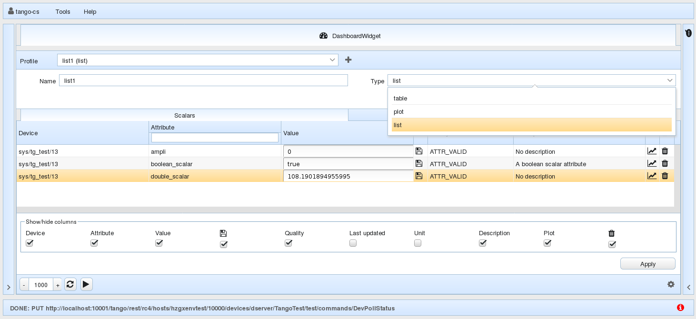

<a href="https://github.com/tango-controls/waltz"></a>

[TOC]

***

Before deepening into Waltz , please, note a list of very simple
actions. 

They really worth doing while using web-applications: 

- _Redo last actions_
- _Refresh the page_
- _Refresh the page with cache drop (CTRL+F5)_

***


# User guide

To start Waltz you should know the link to the application's entry point (e.g. https://fs-webtango.desy.de:8080/hzgxenvtest/).

The application is secured with the login and pass. The credentials should be given by admin department.


The application consists of 5 parts:

1. __Top toolbar__ with menu buttons (About, Scripting, Manager, New issue, Docs, Logout and 2 icons to hide left and right parts of the application);

2. __Left part__ with several panels:
      - Dashboard profiles (where you can create table, list or plot dashboards).
      - Navigation Tree with hosts and devices (easy navigation plus filtering).
      - Device’s panel (where you can find all its attributes, commands and pipes; use filter for quick search; apply commands to attributes and execute commands).
      - Info panel (Shows info about the selected item in the navigation tree or device's panel. It gives possibility to change name, add alias, etc.).

3. __Main view__. Here is the place to look through the dashboards, watch plots, create and execute scripts and use manager.

4. __Right panel__ where user's actions are shown. You can also use button near action to repeat it.

5. __Bottom toolbar__ with log concole. 


## 1 Top toolbar
It contains the following menu items:

-  User's "Log out";
-  Tools with "Scripting" and "Manager";
-  "Help" with links to "About", "User docs" and create a "New issue" in GutHub;
-  2 icons on the edges of the toolbar to hide, thus, tight and left panels of the application and get more space for the dashboards.


### 1.1 "Tools"

#### 1.1.1 Scripting

You can write and execute javascript here. 


_“Scripts” - list of javascript files you have. 

If you want to create a new javascript file, type the name of your future file in _“Script name” field_ and your code in _“Script code”_ box. When click on run button  in the left bottom your script is automatically saved but you must fill _Script name_ first! No need to click on save button  in this case.

_“Script output”_ box shows the result of the scritp. Of course, you can delete your script clicking on . To change the script – select the needed one from the “Scripts” block.


Autocompletion will be enabled by Ctrl+Space. 

_Exercise_: 
``` 
Script name: sum
Script code: return 2+2
Press “ctrl+enter” to execute the script or click execute button
```
```
Script name: readAttribute
Script code:
const host = await PlatformContext.rest.fetchHost('localhost:10000');
const device = await host.fetchDevice('sys/tg_test/1');
const attr = await device.fetchAttr('double_scalar');
const attr_value = await attr => attr.read();
return  value.value;

Press “ctrl+enter” to execute the script
```

#### 1.1.2 Manager


Manager tab was created to make it possible to have an overview of all
Tango Hosts and Tango Servers (under *Tango Severs*). To make Tango
Servers appear, click on Tango Host in the tree from the left panel or
on Tango Host above *Tango Severs* label.

-  Kill button — kills selected server (sends "kill-9");
-  Stop button — stops selected server (uses [Starter](https://tango-controls.readthedocs.io/en/latest/administration/deployment/starter.html)'s "DevStop" command);
-  Start button — starts selected server (uses [Starter](https://tango-controls.readthedocs.io/en/latest/administration/deployment/starter.html)'s "DevStart" command).

All *Tango Devices* are available under "Tango Devices" after selection
of Tango Server. It is also possible to add, update or delete device
using a dedicated box right under the "Tango Devices" label. Place
holders in fields will help you to add a new device in correct way.

*Selected Device info* shows information on the device. It
updates on click. You may also choose device from the Tango device tree
in the left panel to see information about it in this table.

*Manager's Log* provides list of user's actions with servers showing
date, time and action.

### 1.2 User's log out
Use this for correct end of session and to prevent others from changing your settings and managing your hosts and devices.


## 2 Left panel
Consists of the following main parts: 

1. Dashboard profiles;

2. Navigation Tree for hosts and devices with search box;

3. Device's Control with search box;

4. Information and settings block.

This panel can be added with the needed tabs for quich navigation. For example, when the Scripting is opened - a dedicated tab appeared in this panel.


### 2.1 Dashboard profiles


### 2.2 Navigation Tree

Shows all devices you have. In this widget you can configure device, monitor all its attributes and delete it, also filter by text.

The devices tree widget has the following structure:

 — Tango host (in this application it is a container of devices);

 — devices aliases (in this application it is a container of devices);

 — domains, catalog of families within one tango host;

 — family - catalog of devices;
 
 — device.

_Exercise_: 
```
Expand “development”, “sys” → “tg_test”.
```


Search box in Devices tree widget filters the whole tree.

_Exercise_: 
```
Write “tg” in filter box.
Delete “tg” in filter box.
```


You can use aliases instead of members to feel more comfortable with the
names. To do this, please, refer to Description widget.


If you click on the device, all the commands, attributes and pipes
related to this device will be show in Device's Control Widget. The
Device's Control Widget will be updated.


#### 2.2.1 Settings tab


##### 2.2.1.1 Tango REST API URL

Url of REST API entry point. Usually the correct value is set during the deployment so usually you don't need to change it. But it is possible to add new REST API hosts (will rewrite the existing one).

##### 2.2.1.2 Tango hosts

List of user's Tango hosts. You can delete or add Tango hosts here. Template for Tango host: {host}:{port}.

##### 2.2.1.3 Tango Server Wizard

You can add new device(s) here. 

_Exercise_: 
```
Set 
ServerName/Instance: TangoTest/sys
Class name: TangoTest
Devices: sys/tg_test/x;  sys/tg_test/y
```

You have just added it to the database. The newly added devices are not running. You should start manually.

##### 2.2.1.4 Device filters

In fact, there are 3 filters in the application. But two of them (in Devices tree widget and in Device Control Panel) are text filters and the one you have here allows you to combine.

You can apply more complicated filters, define which devices will be available. Moreover, several filters can be run simultaneously. Type each of them on new line and press “Apply filters” button.

To return to the full devices' tree apply: "*/*/*"


_Exercise_: 
```
Set
sys/tg_test/*
tango/*/*
press “Apply”
```


### 2.3 Device's Control

As soon as a device in the Devises' tree is chosen the device's control
widget is updated.
 
> _Hint:_ Double click on the device in the Devices tree opens the device's control widget.


Here you can:
 
- See device's attributes, commands and pipes;
- Drag-n-drop Attributes to the Dashboard;
- Click on attribute or command or pipe to select it for editing;
- Double click on attribute or command or pipe to expand description
  widget;
- Search in Search box which filters all three device child entity types
  simultaneously. __a:__ shows only attributes; __c:__ -- commands; __p:__ -- pipes.
  
  

__NOTE__ _If you get the following error, this means that Tango device is not exported:_

> Reason: TangoProxyException Description: Failed to get proxy for tango://hzgxenvtest.desy.de:10000/development/camel/0:ProxyException in Failed to apply creation policy for proxy development/camel/0 PANIC: TangoApi_DEVICE_NOT_EXPORTED development/camel/0 Not Exported ! Connection(development/camel/0) ERR: TangoApi_CANNOT_IMPORT_DEVICE Cannot import development/camel/0 Connection.build_connection(development/camel/0)[Failed to apply creation policy for proxy development/camel/0:TangoApi_DEVICE_NOT_EXPORTED[development/camel/0 Not Exported !]] Origin: org.tango.web.server.TangoProxyPool.getProxy(TangoProxyPool.java:74)
 

Drag-n-drop an attribute to add it to the dashboard tab in the main view.


__NOTE__ _The difference between “Dashboard” and “Monitor tab” is that you can add any attribute of ANY device to the Dashboard, whereas in
the “Monitor tab” you see all the attributes of one selected device._


_Exercise_: 
```
Select any attribute or command or pipe, 
this also selects it in the Device control panel.
```

To work with the Device's Control Panel you should select the device in
Devices tree widget first. Name of the selected device is shown above
Attributes, Commands and Pipes.

All shown attributes, commands and pipes refer to the selected
device.

In Device's Controls widget it is also possible to control attributes,
commands and pipes. All controls widgets have: 

- 
  \- opens **description** of the chosen item;
-  - opens a new tab with **toolbar** in the main view with
   functionality corresponding to the selectied item (attribute, command or pipe). 
   
This Toolbar has the following controls:

* Number – a refresh/execute rate (milliseconds);
* Refresh button – set a new value of  refresh rate;
* Pause or Start button – to pause or start refreshing/executing.

#### 2.3.1 Attribute's control
You can “Read”, “Plot”, “Plot.Hist” and “Write”. 

* Read – shows info about the attribute;
* Plot – reads the value and plot it. No automatic updates. If you want
  automatic updates, add attribute to monitor to the Dashboard.
* Plot.Hist – plots historical values (usually 10). The number can be set in "Configuration tab" of device.
* Write – writes a new value in the attribute. If you change the value
  by writing a new one in the Device's Control Panel, this attribute
  will be automatically updated in all other tabs and panels;
*  - opens a new tab in the main view with plot depending on the
  type of an attribute.


_Exercise_: 
``` 
Select “my_test”;
select “double_scalar” attribute in the list of attributes;
click “Plot”;
in the text field next to “Write” button enter 100 and click “Write” button;
click “Plot”;
click “Plot.Hist”;
```

#### 2.3.2 Command's control
To execute the command, first choose the command you need, then type the input value. 

If there is an “Input” box, it shows what type of input value should be
written.

 - opens a new tab in the main view with input and output fields
and "Execute" and "Clear all" buttons. 

"Execute" button executes the input value and the result is shown in the
output.

"Clear all" button clears the output field.

_Exercise_: 
```  
Select “DevDouble” enter 3.14 as input and press the “Execute” button
```

#### 2.3.3 Pipe's control
It contains “Read” button. By clicking on it a new tab in the main view
will be opened. In this new tab it is possible to write a new value as 
[JSON](http://tango-rest-api.readthedocs.io/en/latest/device/#device-pipes).


### 2.4 Information and settings block
Contains read-only information. Been automatically updated when click on the name of Tango host (values are loaded from the REST server),
device or attribute, command or pipe.


## 3 Main view

### 3.1 Dashboard tab
In this tab you can create different scalar dashboards of two types:
table and plot.

#### 3.1.1 Table dashboard
*To create a table dashboard* press "+" button to open/close panel. In
the "Name" field put name of your future dashboard and choose "table" in
the "Type" drop-down list. Click on save icon

to create this dashboard.


Drag-n-drop desired attributes from any device to fill dashboard.


Click on the settings icon in the right bottom corner to show/hide
settings panel and delete attributes from the table.


When you click on the value of attribute you can change the value either
in the table or dedicated panel which appears on click.


In fact this table dashboard has the same purpose as Device monitor,
except that scalar attributes can be added here manually from different
devices and you can create several dashboards with different pack of
attributes.


#### 3.1.2 Plot dashboard

*To create a plot dashboard* click on the "+" icon if the dedicated
panel is closed. Change or put name of the future dashboard and select
"plot" type.


Drag-n-drop desired attributes from any device to fill dashboard.

If you want to delete attribute from the plot, click on "settings" button. To start plotting click on "play" 
icon. If you want change an update rate (in milliseconds), write the needed update rate and press 


_Exercise_: 
```
Open “my_test” in Device tree. 
Choose “Double Scalar” in Attributes and add it to the newly created Table dashboard. 
Add “Double Scalar” in Attributes to the newly created Plot table.
Select attribute “short_image_ro” and add it to monitor. 
Select “double_spectrum_ro” and add it to Table dashboard. 
Refresh the page
```

#### 3.1.3 List dashboard

It has the same purpose as [Device monitor](user_guide.md#52-device-monitor), except that attributes can be added here manually from different devices.
You can add any attributes from any devices to the List drag-n-droping from Device widget.



_Exercise_: 
```
Open “my_test_device” in Device tree. 
Choose “Double Scalar” in Attributes and add it to Dashboard using context menu. 
To plot the scalar attribute click on the plot icon.
Select attribute “short_image_ro” and add it to monitor using context menu. 
Select “double_spectrum_ro” and add it to Dashboard using context menu. 
Refresh the page
``` 

Plots are powered by plotly.js. Please refer to
[plotly documentation](https://plot.ly/plotly-js-scientific-d3-charting-library)

To switch between dashboards click on the Profile drop-down list. 


__NOTE__ _To plot non-scalar attribute double click on it in._


## 4 Right panel
Displays user activity.

By clicking on a repeat button  the described action will be done.

## 5 Bottom toolbar

On the right bottom corner you will find application's log and find out what's up with your application.


## Resources

[1] [Waltz Overview (video)](https://vimeo.com/268669625)


