[TOC]

Before deepening into Waltz , please, note a list of very simple actions, but they really worth doing while using web-applications:

  * Redo last actions
  
  * Refresh the page
  
  * Refresh the page with cache drop (CTRL+F5) 

# User guide

To start Waltz you should know the link to the application's entry point (e.g. https://fs-webtango.desy.de:8080/hzgxenvtest/).

The application is secured with the login and pass. The credentials should be given by admin department.

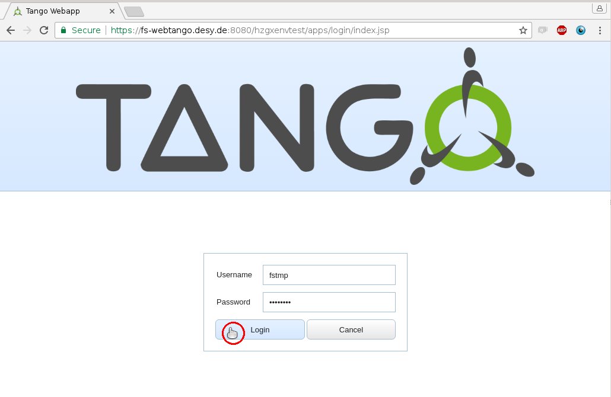

The application consists of 5 parts:

1. Top toolbar;

2. The bottom toolbar; 

3. Left panel with Devices tree widget (the root is the REST API server
   name) with filter by text, Device's Control Widget with filter by
   text, Description widget and Toolbar.

4. Right panel (collapsed by default) - User's actions log;

5. Main view with the Dashboard tab by default.


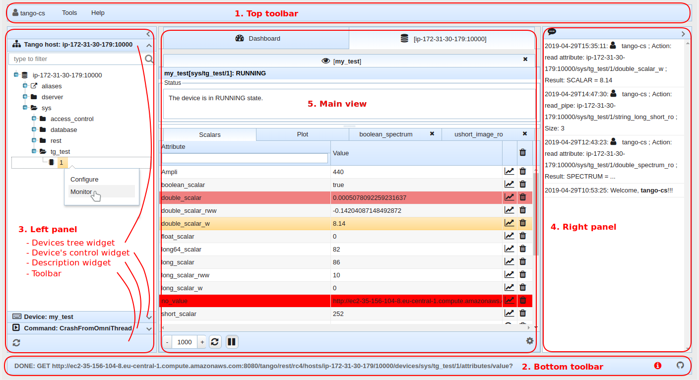


## 1 Top toolbar
On the left it contains the following menu items:

-  User's name with "Settings" and "Sign out" subitems;
-  Tools with "Scripting", "Manager", "Terminal" subitems;
-  "Help" with links to "About", "User docs" and create a "New issue" in
   GutHub.


### 1.1 "Tools" menu

#### 1.1.1 Scripting tab
You can write and execute javascripts here. 

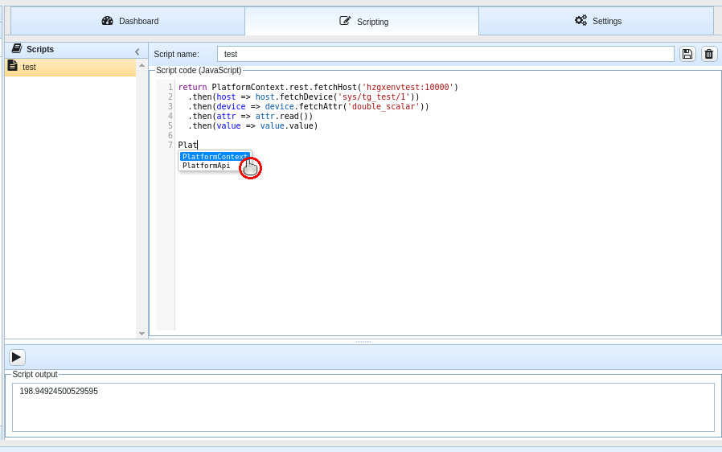

_“Scripts” block_ shows the names of javascript files you have. 

If you want to create a new javascript file, type the name of your future file in _“Script name” field_ and your code in _“Script code”_. When click on run button  in the left bottom your script is automatically saved but you must fill _Script name_ first!

The result of the scritp is shown in _“Script output”_ box. 

Of course, you can delete your script clicking on 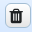. 

To change the script – select the needed one from the “Scripts” block.

_Exercise_: 
``` 
Script name: sum
Script code: return 2+2
Press “ctrl+enter” to execute the script or click execute button
```
```
Script name: readAttribute
Script code:
return PlatformContext.rest.fetchHost('localhost:10000')
  .then(host => host.fetchDevice('sys/tg_test/1'))
  .then(device => device.fetchAttr('double_scalar'))
  .then(attr => attr.read())
  .then(value => value.value)
Press “ctrl+enter” to execute the script
```

#### 1.1.2 Manager

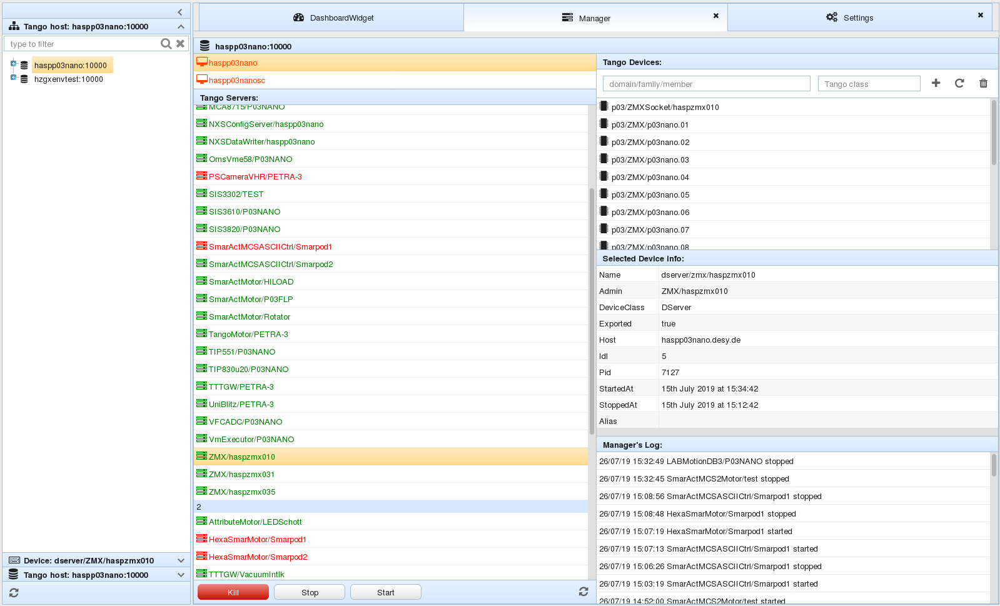

Manager tab was created to make it possible to have an overview of all
Tango Hosts and Tango Servers (under *Tango Severs*). To make Tango
Servers appear, click on Tango Host in the tree from the left panel or
on Tango Host above *Tango Severs* label.

-  Kill button — kills selected server (sends "kill-9");
-  Stop button — stops selected server (uses "Starter" command);
-  Start button — starts selected server (uses "Starter" command).

All *Tango Devices* are available under "Tango Devices" after selection
of Tango Server. It is also possible to add, update or delete device
using a dedicated box right under the "Tango Devices" label. Place
holders in fields will help you to add a new device in correct way.

*Selected Device info* shows all available information on the device. It
updates on click. You may also choose device from the Tango device tree
in the left panel to see information about it in this table.

*Manager's Log* provides list of user's actions with servers showing
date, time and action.

#### 1.1.3 Terminal
A tab with Terminal will allow you to have a fully functional linux
terminal.

### 1.2 User's name 

#### 1.2.1 Settings tab

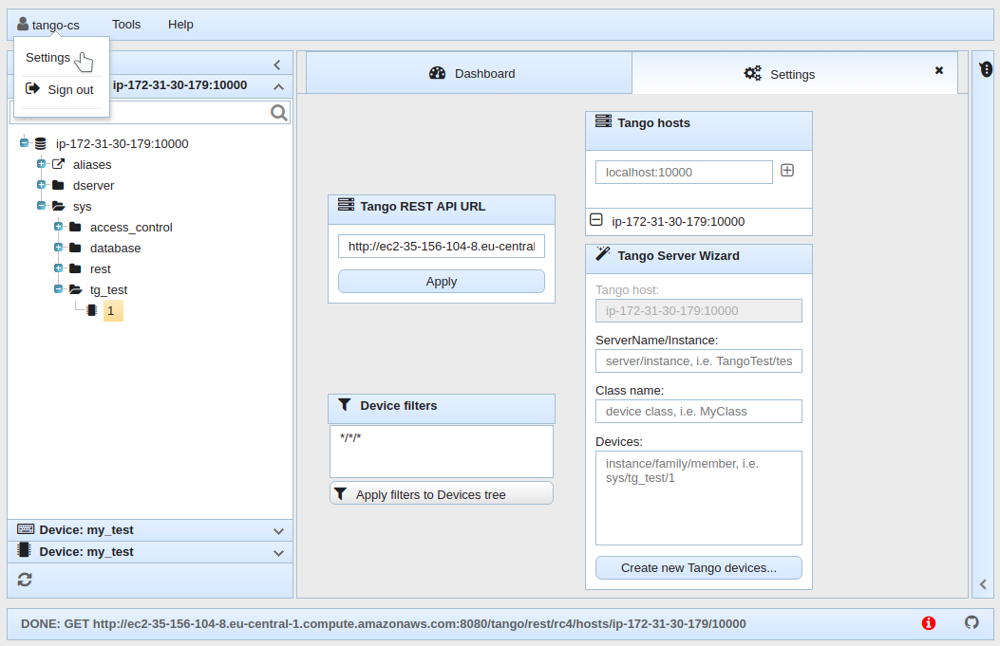

##### 1.2.1.1 Tango REST API URL

Url of REST API entry point. Usually the correct value is set during the deployment so usually you don't need to change it. But it is possible to add new REST API hosts (will rewrite the existing one).

##### 1.2.1.2 Tango hosts

List of user's Tango hosts. You can delete or add Tango hosts here. Template for Tango host: {host}:{port}.

##### 1.2.1.3 Tango Server Wizard

You can add new device(s) here. 

_Exercise_: 
```
Set 
ServerName/Instance: TangoTest/test
Class name: TangoTest
Devices: test/tg_test/x;  test/tg_test/y
```

You have just added it to the database. The newly added devices are not running. You should start manually.

##### 1.2.1.4 Device filters

In fact, there are 3 filters in the application. But two of them (in Devices tree widget and in Device Control Panel) are text filters and the one you have here allows you to combine.

You can apply more complicated filters, define which devices will be available. Moreover, several filters can be run simultaneously. Type each of them on new line and press “Apply filters” button.

To return to the full devices' tree apply: "*/*/*"

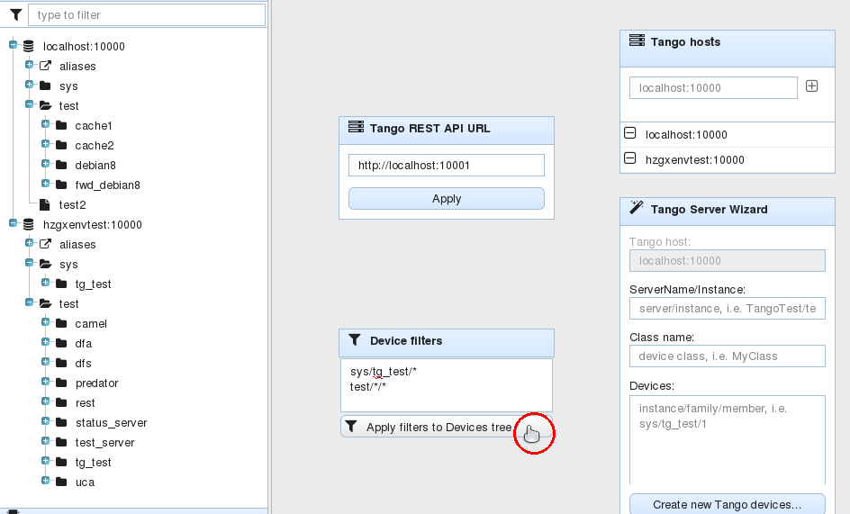

_Exercise_: 
```
Set
sys/tg_test/*
tango/*/*
press “Apply”
```

#### 1.2.2 Sign out
Use this for correct end of session and to prevent others from changing
your settings and managing your hosts and devices.


## 2 Bottom toolbar
On the left — REST API request status (shows current request to the Tango REST Server). Can have the following states:

 - pending — the request is being sent but no response yet;
 - done — response from Tango REST Server have been successfully received;
 - failed — no response or it has an error.

On the right bottom corner you will find 
 
 - application log 
 - “report an issue or bug” button - link to Waltz GitHub repository
     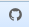

## 3 Left panel
Consists of 4 parts: 

1. Devices tree widget with search box;

2. Device's Control Widget with search box;

3. Description widget;

4. Left panel toolbar.


### 3.1 Devices tree widget

Shows all devices you have. In this widget you can configure device, monitor all its attributes and delete it, also filter by text.

The devices tree widget has the following structure:

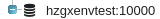 — Tango host (in this application it is a container of devices);

 — devices aliases (in this application it is a container of devices);

 — domains, catalog of families within one tango host;

 — family - catalog of devices;
 
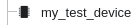 — device.

_Exercise_: 
```
Expand “development”, “sys” → “tg_test”.
```


Search box in Devices tree widget filters the whole tree.

_Exercise_: 
```
Write “tg” in filter box.
Delete “tg” in filter box.
```


You can use aliases instead of members to feel more comfortable with the
names. To do this, please, refer to Description widget.

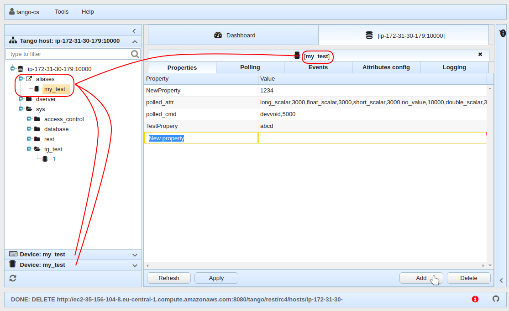

If you click on the device, all the commands, attributes and pipes
related to this device will be show in Device's Control Widget. The
Device's Control Widget will be updated.

#### 3.1.1 Context menu

Right click on the device to open a __context menu__:

 - Configure - opens a new tab with device configuration;
 - Monitor – opens a new tab with all the device's attributes.

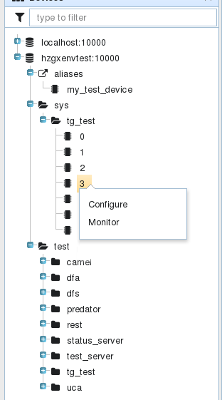

### 3.2 Device's Control Widget

As soon as a device in the Devises' tree is chosen the device's control
widget is updated.
 
_Hint:_ Double click on the device in the Devices tree and you can see
the device's control widget.

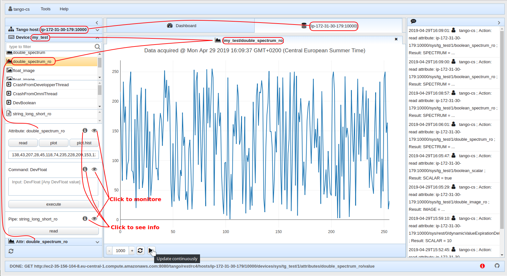

Here you can:
 
- See device's attributes, commands and pipes;
- Drag-n-Drop Attributes to the Dashboard;
- Click on attribute or command or pipe to select it for editing;
- Double click on attribute or command or pipe to expand description
  widget;
- Search in Search box which filters all three device child entity types
  simultaneously. __a:__ shows only attributes; __c:__ -- commands; __p:__ -- pipes.

__NOTE__ if you get the following error, this means that Tango device is
not exported:

> Reason: TangoProxyException Description: Failed to get proxy for tango://hzgxenvtest.desy.de:10000/development/camel/0:ProxyException in Failed to apply creation policy for proxy development/camel/0 PANIC: TangoApi_DEVICE_NOT_EXPORTED development/camel/0 Not Exported ! Connection(development/camel/0) ERR: TangoApi_CANNOT_IMPORT_DEVICE Cannot import development/camel/0 Connection.build_connection(development/camel/0)[Failed to apply creation policy for proxy development/camel/0:TangoApi_DEVICE_NOT_EXPORTED[development/camel/0 Not Exported !]] Origin: org.tango.web.server.TangoProxyPool.getProxy(TangoProxyPool.java:74)
 

Drag-n-Drop an attribute to add it to the dashboard tab in the main view.

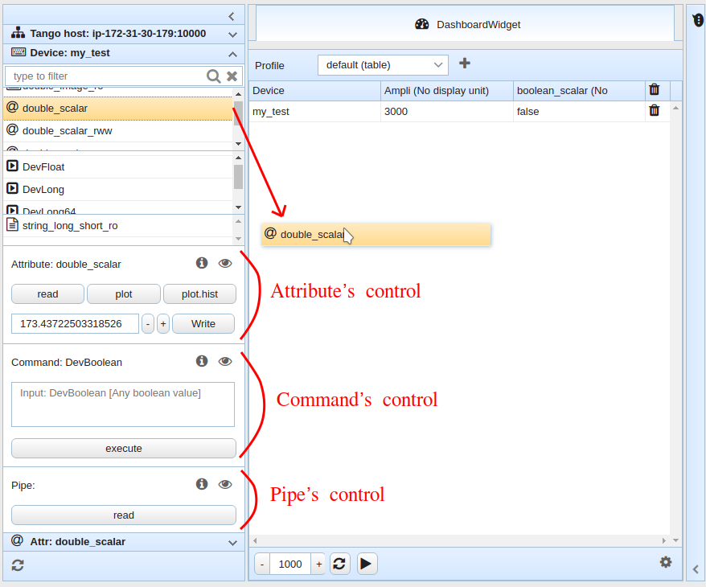

__NOTE__ The difference between “Dashboard” and “Monitor tab” is that you can add any attribute of ANY device to the Dashboard, whereas in the “Monitor tab” you see all the attributes of one device.


_Exercise_: 
```
Select any attribute or command or pipe, 
this also selects it in the Device control panel.
```

To work with the Device's Control Panel you should select the device in
Devices tree widget first. Name of the selected device is shown above
Attributes, Commands and Pipes.

All shown attributes, commands and pipes refer to the selected
device.

In Device's Controls widget it is also possible to control attributes,
commands and pipes. All controls widgets have: 

-  - opens description of the chosen item;
- 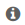 - opens a new tab with **toolbar** in the main view with
   functionality corresponding to the selectied item (attribute, command or pipe). 
   
This Toolbar has the following controls:

* Number – a refresh/execute rate (milliseconds);
* Refresh button – set a new value of  refresh rate;
* Pause or Start button – to pause or strart refreshing/executing.

#### 3.2.1 Attribute's control
You can “Read”, “Plot”, “Plot.Hist” and “Write”. 

* Read – shows info about the attribute;
* Plot – reads the value and plot it. No automatic updates. If you want
  automatic updates, add attribute to monitor to the Dashboard.
* Plot.Hist – plots historical values (usually 10). The number can be set in "Configuration tab" of device.
* Write – writes a new value in the attribute. If you change the value
  by writing a new one in the Device's Control Panel, this attribute
  will be automatically updated in all other tabs and panels;
*  - opens a new tab in the main view with plot depending on the
  type of an attribute.


_Exercise_: 
``` 
Select “my_test”;
select “double_scalar” attribute in the list of attributes;
click “Plot”;
in the text field next to “Write” button enter 100 and click “Write” button;
click “Plot”;
click “Plot.Hist”;
```

#### 3.2.2 Command's control
To execute the command, first choose the command you need, then type the input value. 

If there is an “Input” box, it shows what type of input value should be
written.

 - opens a new tab in the main view with input and output fields
and "Execute" and "Clear all" buttons. 

"Execute" button executes the input value and the result is shown in the
output.

"Clear all" button clears the output field.

_Exercise_: 
```  
Select “DevDouble” enter 3.14 as input and press the “Execute” button
```

#### 3.2.3 Pipe's control
It contains “Read” button. By clicking on it a new tab in the main view
will be opened. In this new tab it is possible to write a new value as 
[JSON](http://tango-rest-api.readthedocs.io/en/latest/device/#device-pipes).


### 3.3 Description widget
Contains readonly information. Been automatically updated when click on
the name of Tango host (values are loaded from the REST server), device
or attribute, command or pipe.

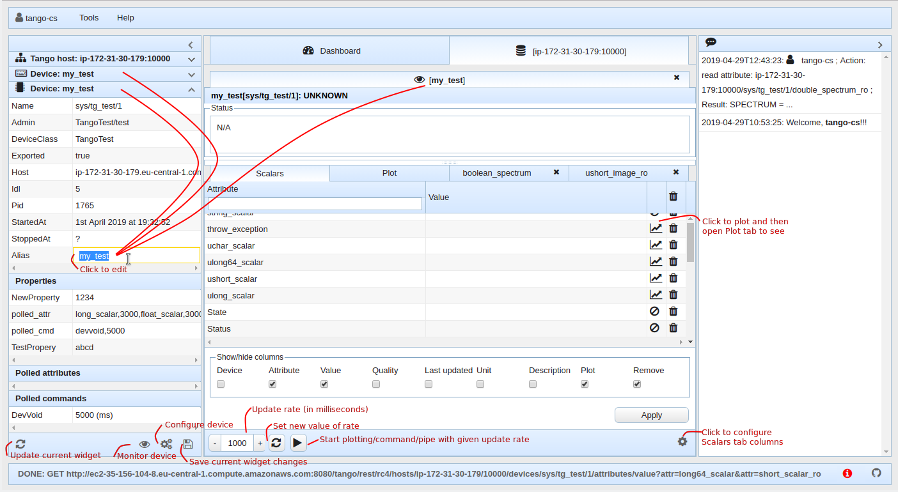


### 3.4 Left panel toolbar 
Depending on which widget of the Left panel you are, the toolbar has
different buttons. 

- 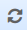
  \- refresh button Devices tree and it is always presented in the
  toolbar;
- 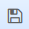
  \- save button appears when you are in the Description button
- 
  \-  monitor button, works the same as Device monitor
- 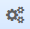
  \- configuration button, works the same as Device configuration
  

## 4 Right panel
Displays user activity.

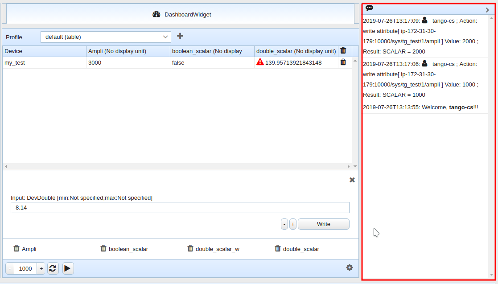

## 5 Main view

### 5.1 Dashboard tab
In this tab you can create different scalar dashboards of two types:
table and plot.

#### 5.1.1 Table dashboard
*To create a table dashboard* press "+" button to open/close panel. In
the "Name" field put name of your future dashboard and choose "table" in
the "Type" drop-down list. Click on save icon

to create this dashboard.

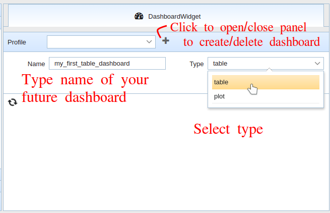

Drag-n-drop desired attributes from any device to fill dashboard.

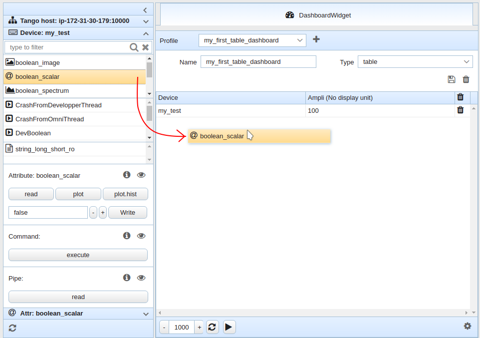

Click on the settings icon in the right bottom corner to show/hide
settings panel and delete attributes from the table.

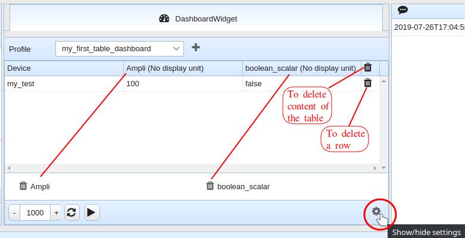

When you click on the value of attribute you can change the value either
in the table or dedicated panel which appears on click.
dashB_table_change_attr_panel
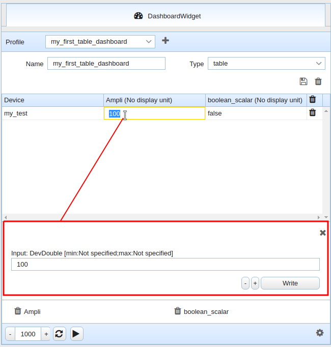

In fact this table dashboard has the same purpose as Device monitor,
except that scalar attributes can be added here manually from different
devices and you can create several dashboards with different pack of
attributes.

#### 5.1.2 Plot dashboard

*To create a plot dashboard* click on the "+" icon if the dedicated
panel is closed. Change or put name of the future dashboard and select
"plot" type.

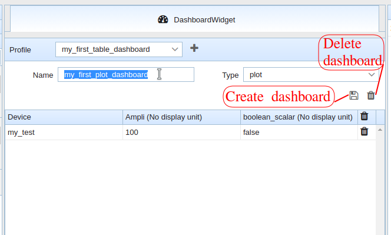

Drag-n-drop desired attributes from any device to fill dashboard.

If you want to delete attribute from the plot, click on "settings"
button. icon_run To start plotting click on "play"

icon. You can also change an update rate (in milliseconds). Write needed
update rate and press  

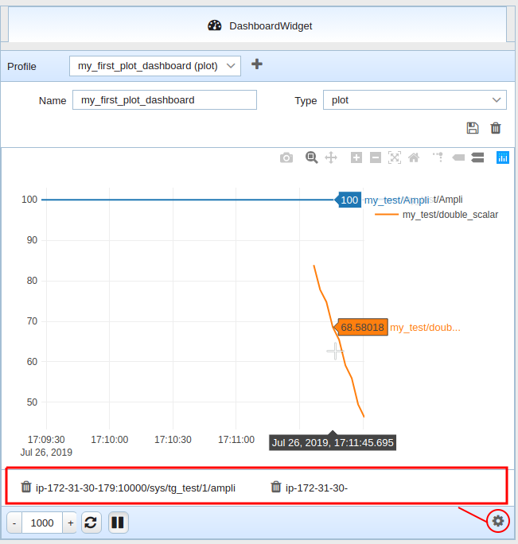


Plots are powered by plotly.js. Please refer to
[plotly documentation](https://plot.ly/plotly-js-scientific-d3-charting-library)


_Exercise_: 
```
Open “my_test” in Device tree. 
Choose “Double Scalar” in Attributes and add it to the newly created Table dashboard. 
Add “Double Scalar” in Attributes to the newly created Plot table.
Select attribute “short_image_ro” and add it to monitor. 
Select “double_spectrum_ro” and add it to Table dashboard. 
Refresh the page
```

To switch between dashboards click on the Profile drop-down list. 

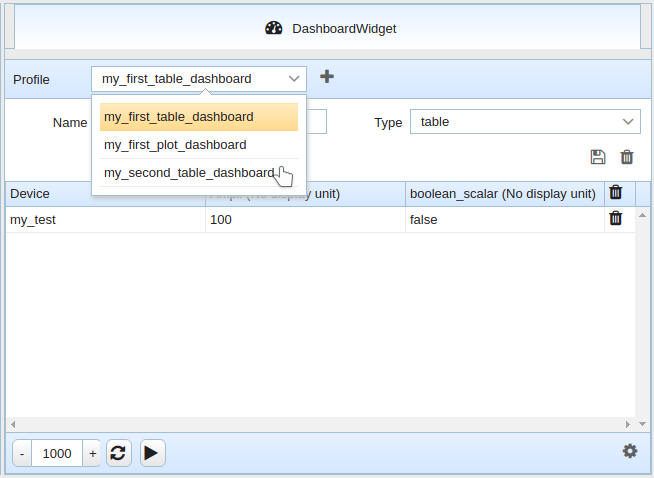


__NOTE__ _To plot non scalar attribute double click on it in._


### 5.2 Device monitor

Right click on the device in Devices tree widget and context menu
appears. Clicking on "Monitor" item of the menu, monitor tab opens in
the main view. The opened tab has the name of the monitored device.

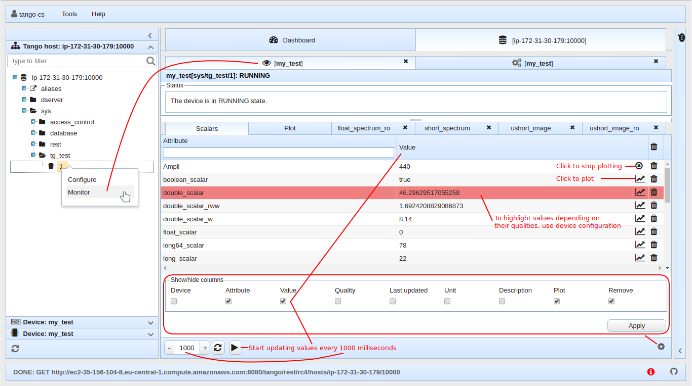

Here you monitor _all_ device's attributes. The tab contains attributes'
monitor view widget with:

* Status bar, 
* Scalars tab with scalars's data table, 
* Plot tab with view of scalars,
* Spectrum tabs, 
* Image tabs and 
* Toolbar. 

_Status bar_ contains information about device. 

Scalar attributes are listed in the _Scalars tab_ as a data table where
you can plot them clicking on the plot icon
(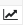). This plot will be shown in the _Plot tab_. To delete the plot just
click on the cross of the related attribute in the Scalars data table.

There is also possibility to configure columns of the Scalars tab by
clicking on  in the toolbar, select the desired columns in the
appeared box and click "Apply" button.

Attributes in Scalar's data table may be highlighted depending on
attribute quality set in Tango (“warning” or “alarm”). You can set these
values using Waltz (Devices tree widget → context menu on the device →
Configure → Attributes config → Alarms).

Each Spectrum and Image attribute will have its own tab. Clicking on a spectrum you get the plot. 

_Toolbar_ has the following controls on the left:

* Number – refresh rate of attributes' values (milliseconds);
* Refresh button – to set a new value of  refresh rate;
* Start/Pause button – to start/pause refreshing.

Plots are powered by plotly.js. Please, refer to
[plotly documentation](https://plot.ly/plotly-js-scientific-d3-charting-library)

__NOTE__ _Values are updated only if visible._

__NOTE__ _To start plotting use Start button in toolbar._

_Exercise_: 
```
Go “sys” → “tg_test” → “my_test”.
Choose “Monitor” from the context menu.
```

_Exercise_: 
```
Click on the plot icon of “Double Scalar” attribute.
Click on the plot icon of “short_scalar” attribute.
To stop plotting “Double Scalar” attribute click on “x” in the data table.
Open “double_spectrum_ro”.
Open “short_image_ro”.
```

_Exercise_: 
```
Set 3000 and press refresh button. 
```

### 5.3 Device configuration

Right click on the device in Devices tree widget and context menu
appears. Clicking on "Configure" item of the menu, device configuration
tab (new tab in the main view) opens with the name of the configured
device.

Configuration tab contains properties, polling, events, attributes configuration and logging tabs which in their turn have their own tabs.

For example, in the properties tab you can add, refresh, apply, delete
property. Click on the value and you can change it. Press "Apply" to
save the changes.

Here you can also set the validity of attribute to make it
highlighted while monitoring.

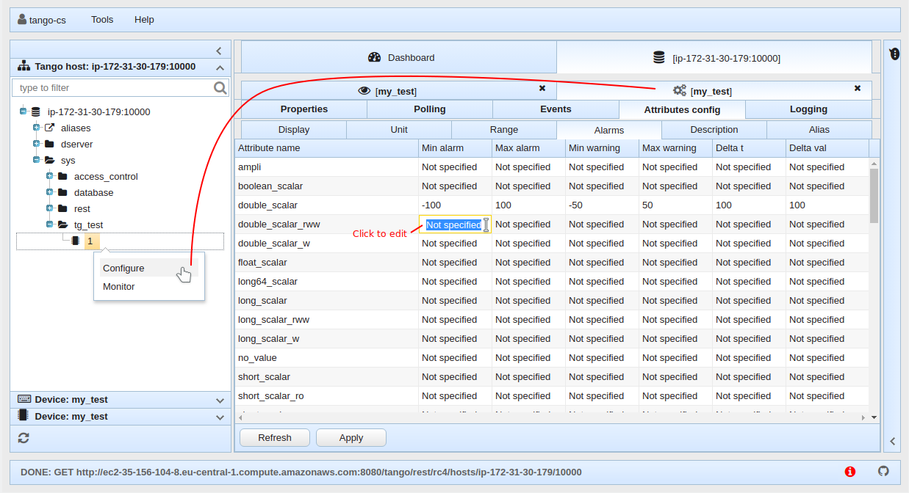

The rest tabs work the same way. 

_Exercise_: 
```
Go “sys” → “tg_test” → “my_test”.
Choose “Configure” from the context menu.
```


## Resources

[1] [Waltz Overview (video)](https://vimeo.com/268669625)


