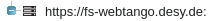

# User guide

To start Waltz you should know the link to the application's entry point (e.g. https://fs-webtango.desy.de:8080/hzgxenvtest/).

The application is secured with the login and pass. The credentials should be given by admin department.

The application consists of 5 parts:

1) Top tool bar (text filter, Devices tree and Device tree);

2) The bottom tool bar; 

3) Left panel with Devices tree (the root is the REST API server mane), Device tree tab (with device name as a root) and a filter by text;

4) Main view with the 3 tabs: Dashboard, Scripting and Settings;

5) Right panel (collapsed by default) - Device Control Panel.


## Top toolbar
On the left has logos that link to the corresponded websites. 
On the right — the user name (by clicking on it you can access Setting tab) and logout button.


## Bottom toolbar
On the left — REST API request status (shows current request to the Tango REST Server). Can have the following states:
* pending — the request is being sent but no response yet;
* done — response from Tango REST Server have been successfully received;
* failed — no response or it has an error.

On the right bottom corner you will find 
* user's actions log (), 
* application log () and 
* “report an issue or bug” button - link to Waltz GitHub repository ().


## Left panel
Consists of 3 parts: Filter by text, Devices Controls Widget and Device Controls Widget.

### Left panel filter
Simple filter by text. 

_Exercise_: 
```
Write “tg” in filter box.
Delete “tg” in filter box.
```

### Devices tree widget

Shows all devices you have. In this widget you can configure device, monitor all its attributes and delete it, also filter by text.

Usually, the devices tree widget has the following structure:

 — Tango REST API URL (the entry point, connected with Tango);

 — Tango host (in this application it is a container of devices);

 — domains, catalog of families within one tango host;

 — family - catalog of devices;
 
 — device.

_Exercise_: 
```
Expand “development”, “sys” → “tg_test”.
```

You can use aliases instead of members to fell more comfortable with the names. 

If you click on the device, all the commands, attributes and pipes related to this device will be show in the Control Panel on the right. The Device Controls Widget will be also updated.

Right click on the device and you open a __context menu__:
 * Configure - opens a new tab with device configuration.
 * Monitor – opens a new tab with all the device's attributes.
 * Delete – obviously, delete the device.


#### Device configuration
Right click on the device allows to open context menu and choose "Configure" menu item. It opens device configuration tab (new tab in the main view) with the name of the configurated device.

Configuration tab contains properties, polling, events, attributes configuration and logging tabs which in their turn have their own tabs.

For example, in the properties tab you can add, refresh, apply, delete property. Double click on the value and you can change it. 

Here you can set the validity of the attribute to make it highlighted while monitoring.

The rest tabs work the same way. 

_Exercise_: 
```
Go “sys” → “tg_test” → “my_test_device”.
Choose “Configure” from the context menu.
```

#### Device monitor

Right click on the "Monitor" in the device context menu and the monitor tab opens in the main view. The opened tab has the name of the monitored device.

Here you monitor _all_ devices' attributes. The tab contains attributes' monitor view widget with:
* Status bar, 
* Scalar plot view, 
* Scalar's data table, 
* Spectrum tabs, 
* Image tabs and 
* tool bar. 

_Status bar_ contains information about device. 

Scalar attributes are listed in the _Scalar's data table_ where you can plot them clicking on the plot icon (). This plot will be shown in the _Scalar plot view_. To delete the plot just click on the cross of the related attribute in the Scalar's data table.

Attributes in  Scalar's data table may be highlighted depending on attribute quality set in Tango (“warning” or “alarm”). You can set these values using Waltz (Devices tree widget → context menu on the device → Configure → Attributes config → Alarms).

Each Spectrum and Image attribute will have its own tab. Clicking on a spectrum you get the plot. 

_Tool bar_ has the following controls:
* Arrow – shows status of refreshing of attributes' values;
* Number – refresh rate of attributes' values (milliseconds);
* Refresh button – to set a new value of  refresh rate;
* Pause button – to pause refreshing.

__NOTE__ Values are updated only if visible.

_Exercise_: 
```
Go “sys” → “tg_test” → “my_test_device”.
Choose “Monitor” from the context menu.
```

_Exercise_: 
```
Click on the plot icon of “Double Scalar” attribute.
Click on the plot icon of “short_scalar” attribute.
To stop plotting “Double Scalar” attribute click on “x” in the data table.
Open “double_spectrum_ro”.
Open “short_image_ro”.
```

_Exercise_: 
```
Set 3000 and press refresh button. 
```

### Device widget

As soon as the device in the Devises' tree is chosen the device widget is updated. 
 
_Hint:_ Double click on the device in the Devices tree and you can see the device structure and info.

Here you can:
* get info about the device;
* can see device's attributes, commands and pipes;
* use context menu on Attributes to add to the Dashboard (“Add to monitor”);
* click on attribute or command or pipe to select it in Device Control Panel.

__NOTE__ if you get the following error, this means that Tango device is not exported:

> Reason: TangoProxyException Description: Failed to get proxy for tango://hzgxenvtest.desy.de:10000/development/camel/0:ProxyException in Failed to apply creation policy for proxy development/camel/0 PANIC: TangoApi_DEVICE_NOT_EXPORTED development/camel/0 Not Exported ! Connection(development/camel/0) ERR: TangoApi_CANNOT_IMPORT_DEVICE Cannot import development/camel/0 Connection.build_connection(development/camel/0)[Failed to apply creation policy for proxy development/camel/0:TangoApi_DEVICE_NOT_EXPORTED[development/camel/0 Not Exported !]] Origin: org.tango.web.server.TangoProxyPool.getProxy(TangoProxyPool.java:74)
 

Clicking on “Add to monitor” in the context menu of the attribute, you add it to the dashboard tab in the main view. The dashboard has the same view widget structure as the "monitor tab".

__NOTE__ The difference between “Dashboard” and “Monitor tab” is that you can add any attribute of ANY device to the Dashboard, whereas in the “Monitor tab” you see all the attributes of one device.


_Exercise_: 
```
Select any attribute or command or pipe, 
this also selects it in the Device control panel.
```

## Right panel - Device Controls Panel
It has 3 tabs (Attributes, Commands and Pipes) each of which has filter by text.

To work with the Device Controls Panel you should select the device first (e.g. in Devices tree widget or in Device widget or click on an attribute in the Dashboard etc.). Name of the selected device is shown above Attributes, Commands and Pipes tabs.

All the attributes, commands and pipes refer to the selected device.

### Attributes tab
You can “Read”, “Plot”, “Plot.Hist” and “Write”. 
* Read – shows info about the attribute;
* Plot – reads the value and plot it. No automatic updates. If you want automatic updates, add attribute to monitor to the Dashboard in Device widget.
* Plot.Hist – plots historical values (usually 10). The number can be set in "Configuration tab" of device.
* Write – writes a new value in the attribute. If you change the value by writing a new one in the Device Controls Panel, this attribute will be automatically updated in all other tabs and panels.

_Exercise_: 
``` 
Select “my_test_device”;
select “double_scalar” attribute in the list of attributes;
click “Plot”;
in the text field next to “Write” button enter 100 and click “Write” button;
click “Plot”;
click “Plot.Hist”;
```

### Commands tab
To execute the command, first choose the command you need, then type the input value. 

“Input” and “Output” boxes show what type of input value should be written and what output to expect.

_Exercise_: 
```  
Select “DevDouble” enter 3.14 as input and press the “Execute” button
```

### Pipes tab
It contains “Read” and “Write” buttons and field where you can write value as [JSON](http://tango-rest-api.readthedocs.io/en/latest/device/#device-pipes).


## Main view

### Dashboard tab
Same as Device monitor, except that attributes can be added here manually from different devices.
You can add any attributes from any devices to the Dashboard using context menu on the corresponding attributes.

_Exercise_: 
```
Open “my_test_device” in Device tree. 
Choose “Double Scalar” in Attributes and add it to Dashboard using context menu. 
To plot the scalar attribute click on the plot icon.
Select attribute “short_image_ro” and add it to monitor using context menu. 
Select “double_spectrum_ro” and add it to Dashboard using context menu. 
Refresh the page
```

### Settings tab

**Tango REST API URL**

Url of REST API entry point. Usually the correct value is set during the deployment so normally you don't need to change it.

**Tango hosts**

List of user's Tango hosts. You can delete or add Tango hosts here. Template for Tango host: {host}:{port}.

**Tango host info**

Readonly information about host. Been automatically updated when click on the name of Tango host.  The values is loaded from the REST server.

**Tango Server Wizard**

You can add new device(s) here. 

_Exercise_: 
```
Set 
ServerName/Instance: TangoTest/test
Class name: TangoTest
Devices: test/tg_test/x;  test/tg_test/y
```

You have just added it to the database. The newly added devices are not running. You should start manually.

**Device filters**

In Devices tree panel you can only use text filter. Here you can apply more complicated filters. Define which devices will be available for the user. Moreover, several filters can be run simultaneously. Type each of them on new line and press “Apply filters” button.

To return to the full devices' tree apply: */*/*

_Exercise_: 
```
Set
sys/tg_test/*
tango/*/*
press “Apply”
```

### Scripting tab
You can write and execute javascripts here. “Scripts” block shows the names of javascript files you have. If you want to create a new javascript file, type the name of your future file in “Script name” field and your code in “Script code”. When click on run () button in the left bottom your script is automatically saved but you must fill Script name first!The result of the scritp is shown in “Script output” box. Of course, you can delete your script clicking on (). To change the script – select needed one from the “Scripts” block.

_Exercise_: 
``` 
Script name: sum
Script code: return 2+2
Press “ctrl+enter” to execute the script or click execute button
```
```
Script name: readAttribute
Script code:
return PlatformContext.rest.fetchHost('localhost:10000')
  .then(host => host.fetchDevice('sys/tg_test/1'))
  .then(device => device.fetchAttr('double_scalar'))
  .then(attr => attr.read())
  .then(value => value.value)
Press “ctrl+enter” to execute the script
```


