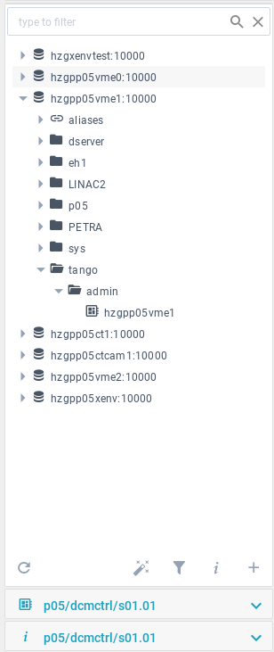

<a href="https://github.com/tango-controls/waltz"></a>

[TOC]

***
__Before deepening into Waltz, please, note a list of very simple
actions that really worth doing while using web-applications: 

- _Redo last actions_
- _Refresh the page_
- _Refresh the page with cache drop (CTRL+F5)_


***


# User guide

To start Waltz you should know the link to the application's entry point (e.g. https://fs-webtango.desy.de:8080/hzgxenvtest/).

The application is secured with the login and pass. The credentials should be given by admin department.


The application consists of 5 parts:

1. __Top toolbar__ with menu buttons (About, Scripting, Manager, New issue, Docs, Logout and 2 icons to hide left and right parts of the application);

2. __Left part__ with several panels:
      - Dashboard profiles (where you can create table, list or plot dashboards).
      - Navigation Tree with hosts and devices (easy navigation plus filtering).
      - Device’s panel (where you can find all its attributes, commands and pipes; use filter for quick search; apply commands to attributes and execute commands).
      - Info panel (Shows info about the selected item in the navigation tree or device's panel. It gives possibility to change name, add alias, etc.).

3. __Main view__. Here is the place to look through the dashboards, watch plots, create and execute scripts and use manager.

4. __Right panel__ where user's actions are shown. You can also use button near action to repeat it.

5. __Bottom toolbar__ with log concole. 


## 1 Top toolbar
It contains the following menu items:

-  User's "Log out";
-  Tools with "Scripting" and "Manager";
-  "Help" with links to "About", "User docs" and create a "New issue" in GutHub;
-  2 icons on the edges of the toolbar to hide, thus, tight and left panels of the application and get more space for the dashboards.


### 1.1 "Tools"

#### 1.1.1 Scripting

You can write and execute javascript here. 


_“Scripts”_ - list of javascript files you have. 

If you want to create a new javascript file, type the name of your future file in _“Script name” field_ and your code in _“Script code”_ box. When click on run button  in the left bottom your script is automatically saved but you must fill _Script name_ first! No need to click on save button  in this case.

_“Script output”_ box shows the result of the scritp. Of course, you can delete your script clicking on . To change the script – select the needed one from the “Scripts” block.


Autocompletion will be enabled by Ctrl+Space. 

_Exercise_: 
``` 
Script name: sum
Script code: return 2+2
Press “ctrl+enter” to execute the script or click execute button
```
```
Script name: readAttribute
Script code:
const host = await PlatformContext.rest.fetchHost('localhost:10000');
const device = await host.fetchDevice('sys/tg_test/1');
const attr = await device.fetchAttr('double_scalar');
const attr_value = await attr => attr.read();
return  value.value;

Press “ctrl+enter” to execute the script
```

#### 1.1.2 Manager


Manager tab was created to make it possible to have an overview of all
Hosts and Servers. To make
Servers appear, click on Tango Host in the tree from the left panel or
on Tango Host above *Tango Severs* label.

-  Kill button — kills selected server (sends "kill-9");
-  Stop button — stops selected server (uses [Starter](https://tango-controls.readthedocs.io/en/latest/administration/deployment/starter.html)'s "DevStop" command);
-  Start button — starts selected server (uses [Starter](https://tango-controls.readthedocs.io/en/latest/administration/deployment/starter.html)'s "DevStart" command).

All *Tango Devices* are available under "Tango Devices" after selection
of Tango Server. It is also possible to add, update or delete device
using a dedicated box right under the "Tango Devices" label. Place
holders in fields will help you to add a new device in correct way.

*Starter's Log* provides list of user's actions with servers showing
date, time and action.

To see information about the selecter item (host, server or device) or change settings of the selected item, click on a dedicated tab with  sign on the left panel. 

### 1.2 User's log out
Use this for correct end of session and to prevent others from changing your settings and managing your hosts and devices.

### 1.3 Help

This will navigate to the documentation and GitHub page of the Waltz project.


## 2 Left panel
Consists of the following main parts: 

1. Dashboard profiles;

2. Navigation Tree for hosts and devices with search box;

3. Device's Control with search box;

4. Information and settings block.

This panel can be added with the needed tabs for quick navigation. For example, when the Scripting is opened - a dedicated tab is appeared in this panel.


### 2.1 Dashboard profiles
It is the place where table, plot or list dashboard can be created. Attributes can be added to the dashboards from different devices,so you can create several dashboards with different pack of attributes.


Create a dashboard by clicking on “+”, choose the type (table, list or plot) and put the name. Make sure to hit "V" button, thus, save the newly created dashboard. Choose device from the Navigation tree and open devices control panel (also possible to open it by double clicking on the device in the tree). To delete a dashboard – choose it and hit “basket” button.

Drag-n-drop desired attributes form one/different devices to the dashboard from Device's control panel.

When click on the value of attribute in the dashboard, the value can be changed.

Each dashboard has a toolbar with the following controls:

* Refresh button – set a new value of  refresh rate;
* Pause or Start button – to pause or start refreshing/executing;
* Number – a refresh/execute rate (milliseconds).

To switch between dashboards, click on the dashboard name in Dashboard profiles panel.

#### 2.1.1 Table 
Table bashboard - the first column of the table is filled with unique devices’ names, other columns have attribute names as headers. Drag-n-drop an attribute form different devices if needed and it will add a new column to the table if there is no column with such attribute’s name and add new line if there has been no such device in the table yet.
Use control underneath the table (hit “gear” button to show/hide it) to delete the column or freeze the table to avoid changes.


#### 2.1.2 List
A list of attributes form one/different devices to monitor. Drag-n-drop attribute to add to the list table. It has fixed number of columns which can be hidden/shown (hit “gear” button underneath the table for these settings).

#### 2.1.3 Plot
Dashboard where different attributes from one/different devices can be plotted together. If you want to delete an attribute – use control (“gear” button).

Plots are powered by plotly.js. Please refer to
[plotly documentation](https://plot.ly/plotly-js-scientific-d3-charting-library)

To start plotting click on "play"  icon. If you want change an update rate (in milliseconds), write the needed update rate and press 


### 2.2 Navigation Tree

Shows all hosts and devices you have in a tree view. When you click on the tree element,  Info panel is updated. In case of device –  Info panel and  Device’s Control panel are updated. 

Search box helps to filter the whole tree.




The Navigation tree widget has the following structure:

 — host (a container of devices);

 — aliases - list devices for which aliases were created;

 — catalog of devices;
 
 — device.

_Exercise_: 
```
Expand “development”, “sys” → “tg_test”.
```


_Exercise_: 
```
Write “tg” in filter box.
Delete “tg” in filter box.
```


You can use aliases to feel more comfortable with the
names. To do this, please, refer to  Information panel.

If you click on the device, all the commands, attributes and pipes
related to this device will be show in  Device's Control Widget.


#### 2.2.1 Settings

Navigation tree settings are located under the tree. To show/hide the desired setting block click on a dedicated icon.

##### 2.2.1.1 Add/Delete Tango hosts

You can delete or add hosts here. 

Put the name and port and add by clicking on "+" sign nereby.

To delete - select the host in the list and click on "-" sign infront of the selected item.


##### 2.2.1.2 Hosts' DB information

Select the host and information about its database will be shown.


##### 2.2.1.3 Devices' filters

There is a text filter above the tree.

You can apply more complicated filters and define which hosts or devices will be available. Moreover, several filters can be run simultaneously. Type each of them on a new line and press “Apply...” button.

To return to the full devices' tree apply: "*/*/*"


_Exercise_: 
```
Set
sys/tg_test/*
tango/*/*
press “Apply device filters...”
```

##### 2.2.1.4 Tango Server Wizard

A new device(s) can be added here. By clicking on "Create ..." button, a newly created device is added to the database.


_Exercise_: 
```
Set 
ServerName/Instance: TangoTest/sys
Class name: TangoTest
Devices: sys/tg_test/x;  sys/tg_test/y
```


### 2.3 Device's Control

Choose the device from the navigation tree and see all device’s attributes, commands and pipes in this panel. 

> _Hint:_ Double click on the device in the Navigation tree opens the device's control panel.

Click on attribute, command or pipe opens/hides setting.

Here you can:
 
- See device's attributes, commands and pipes;
- Drag-n-drop Attributes to the Dashboards;
- Click on attribute or command or pipe to select it for editing;
- Double click on attribute or command or pipe to expand Information panel;
- Use seach box.
 
 __Filter__ will help to find the necessary one. Drop down list with special symbols (“a:” - for attribute; “c:” - for command; “p:” - for pipes) will help to search only in the selected category and hide others (e.g. in case of “a:” - command and pipes will be hidden and the filter will the applied for attributes only).
 
_Click on_ attribute, command or pipe opens/hides setting.
 

 
 
 
  

__NOTE__ _If you get the following error, this means that Tango device is not exported:_

> Reason: TangoProxyException Description: Failed to get proxy for tango://hzgxenvtest.desy.de:10000/development/camel/0:ProxyException in Failed to apply creation policy for proxy development/camel/0 PANIC: TangoApi_DEVICE_NOT_EXPORTED development/camel/0 Not Exported ! Connection(development/camel/0) ERR: TangoApi_CANNOT_IMPORT_DEVICE Cannot import development/camel/0 Connection.build_connection(development/camel/0)[Failed to apply creation policy for proxy development/camel/0:TangoApi_DEVICE_NOT_EXPORTED[development/camel/0 Not Exported !]] Origin: org.tango.web.server.TangoProxyPool.getProxy(TangoProxyPool.java:74)
 


_Exercise_: 
```
Select any attribute or command or pipe, 
this also selects it in the Device control panel.
```

To work with the Device's Control Panel you should select the device in
Navigation tree first. Name of the selected device is shown above
Attributes, Commands and Pipes.

All shown attributes, commands and pipes refer to the selected
device.

It is also possible to control attributes, commands and pipes in the Device's Controls widget.

#### 2.3.1 Attribute's control
Depending on the type of the attribute, it is possible to “Read”, “Plot”, “Plot.Hist” and “Write”. 

* Read – shows value of the selected attribute;
* Plot – reads the value and plot it. No automatic updates. If you want
  automatic updates,use controls presented in the dashboard.
* Plot.Hist – plots historical values (usually 10). The number can be set in Information panel of device.
* Write – writes a new value in the attribute. If you change the value
  by writing a new one in the Device's Control Panel, this attribute
  will be automatically updated in all other tabs and panels.


Double click on the attribute will open a plot in the main view.

_Exercise_: 
``` 
Select “my_test”;
select “double_scalar” attribute in the list of attributes;
click “Plot”;
in the text field next to “Write” button enter 100 and click “Write” button;
click “Plot”;
click “Plot.Hist”;
```

#### 2.3.2 Command's control
To execute the command, first choose the command you need, then type the input value. The “Input” box shows what type of input value should be
written.

Double click on the command opens a tab in the main view.

"Execute" button executes the input value and the result is shown in the output.

"Clear all" button clears the output field.

_Exercise_: 
```  
Select “DevDouble” enter 3.14 as input and press the “Execute” button
```

#### 2.3.3 Pipe's control
It contains “Read” button. By clicking on it a new tab in the main view
will be opened. In this new tab it is possible to write a new value as 
[JSON](http://tango-rest-api.readthedocs.io/en/latest/device/#device-pipes).


### 2.4 Information and settings block
Contains information and setting for attributes. They are automatically updated when click on the name of Tango host (values are loaded from the REST server),
device or attribute, command or pipe.


Items of the Information panel:


Expanded items of the Information panel:


## 3 Main view

The main place for control and monitoring. The place where different dashboards, plots, scripts and manager appear.


## 4 Right panel
Displays user activity.

By clicking on a repeat button  the described action will be done.

## 5 Bottom toolbar

On the right bottom corner you will find application's log and find out what's up with your application.


## Resources

[1] [Waltz Overview (video)](https://vimeo.com/268669625)


# How to

### create a table with attributes from different devices to monitor or set new values?
  - Open dashboard profiles tab and click on “+” button in the bottom. Set the name and select “table” view, then click on “V” button to create a new table dashboard. 
  - Find and click on the device (in Navigation Tree tab) from which you want to monitor or update the attributes.
  - Double click on the device to open a list of attributes or just select the tab underneath the Navigation Tree tab. Drag-n-drop the desired attributes to the dashboard.
  
### have several sets of attributes according to my needs for better monitoring and control?
It is possible to create several dashboards (table, list, plot) and drag-n-drop attributes form different devices.

### get a scalar, spectrum or image view?
Double click on the device in the Navigation Tree to open the Device’s Control tab with all its attributes. Double click on the attribute to plot it. Depending on the type of attribute it will be scalar, spectrum or image.

### find the device?
There are 2 ways to find the device. The easiest way is to the Navigation Tree tab and start to type the name in the filter which is on the top of this tab. Another way is to use more complicated filter. There is a special “bottleneck” button on the bottom of the Navigation Tree tab. Using it you can define host being available after filtering.

### find the attribute?
Select the device from which you need the attribute in the Navigation Tree tab and double click on it to open the Device’s Control tab with attributes. Scroll the list of attributes or start to type in the filter box of the Device’s Control.

### set alarms to the attributes of the device(s)?
It is possible to do in the Info Control panel but first you should select an attribute of the device.

### execute a command?
Double click on the device in the Navigation Tree to open the Device’s Control tab with the list of commands. Find the command (filter on the top of the tab may help) you need and execute it. Type arguments if necessary.

### set an alias to have a quick access to the device(s)?
It is possible to do in the Info Control panel but first you should select the device in the Navigation Tree tab.

### quickly repeat an action?
All actions are registered in the users’ log tab on the left side panel. If you want to repeat an action, click on the “arrow” button near the action.

### add a new host?
In the Navigation Tree tab click on the “+” button to open settings bar. Put host's name and its port. Add this information to the Navigation Tree by clicking on the “+” near the input box.

### delete host?
In the Navigation Tree tab click on the “+” button to open settings bar. Click on the "-" button near the host you want to delete.

### add device to the database?
Please, refer to the part _2.2.1.4 Tango Server Wizard_ of this User Guide.

### get information about the host?
Open the Navigation Tree tab, select the needed host and then either click on “i” button under the tree or click on the Info Control panel.

### get more information about the application? 
There is a “?” item in the upper menu with “About”, “User docs”, “New issue” subitems.


